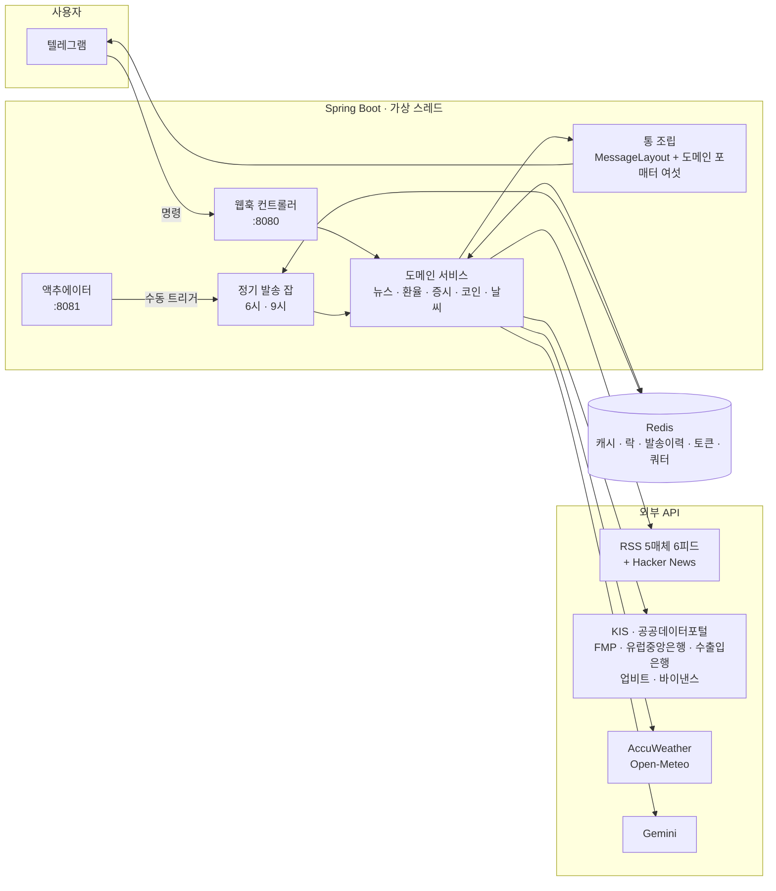
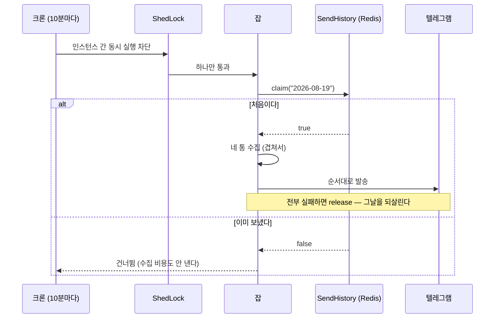
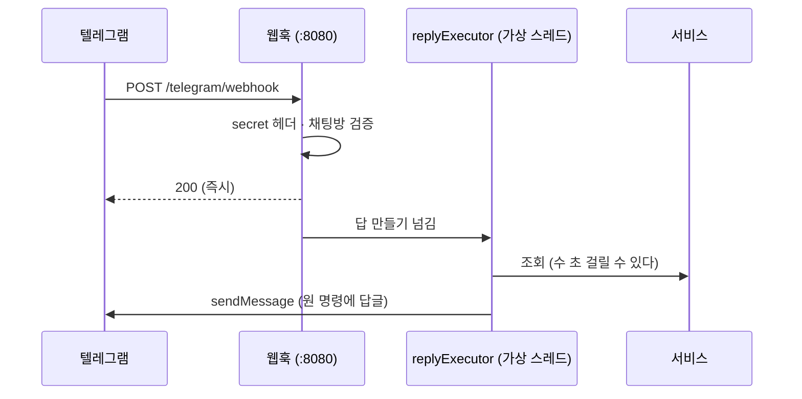
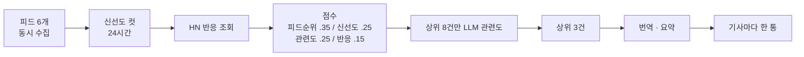

# 아키텍처와 그 이유

이 문서는 **왜 이렇게 만들었고, 안 그랬으면 어떻게 됐는지**를 적는다.

저장소에 문서가 셋이고 역할이 갈린다. 겹치면 한쪽만 낡는다.

| 문서 | 맡는 것 |
|---|---|
| `CLAUDE.md` | **무엇을** 만드는가 — 요구사항과 출처별 결정 |
| `DEPLOY.md` | **어디에** 올리는가 — 배포처·환경변수·웹훅 등록 |
| `ARCHITECTURE.md` (이 문서) | **왜 이렇게** 만들었는가 — 구조·프로세스·트레이드오프 |

## 어디를 볼 것인가

| 알고 싶은 것 | 절 |
|---|---|
| 어떻게 돌리나 (로컬·컨테이너·CI) | [1. 구동](#1-구동) |
| 전체 그림과 패키지 경계 | [2. 한눈에](#2-한눈에) |
| 정기 발송이 하루 한 번인 이유 · 웹훅이 답을 늦게 만드는 이유 · 뉴스 순위 | [3. 프로세스 셋](#3-프로세스-셋) |
| **이중화·캐시·리미터·LLM·화면 표기의 규칙** — 고칠 때 가장 먼저 볼 곳 | [4. 관통하는 규칙 여섯](#4-관통하는-규칙-여섯) |
| 텔레그램·웹훅·Redis 하나를 고른 이유와 그 대가 | [5. 갈림길과 대가](#5-갈림길과-대가) |
| 테스트 규칙 넷과 골든 파일 | [6. 테스트](#6-테스트) |
| **지금 안 되는 것** (NYSE 종목 등) | [7. 알려진 한계](#7-알려진-한계) |

> 새로 온 사람은 **2 → 4 → 7** 순으로 읽으면 가장 빠르다. 무엇을 만드는지는 `CLAUDE.md`가,
> 어디에 올리는지는 `DEPLOY.md`가 맡는다.

---

## 1. 구동

### 필요한 것

- **JDK 21** — 가상 스레드를 쓴다. `build.gradle`의 툴체인과 CI(`setup-java`)가 같은 21이어야 한다.
- **Docker** — 로컬 Redis와 `DigestIntegrationTest`(Testcontainers)가 쓴다.
- **API 키** — 하나도 없어도 앱은 뜬다. 빈 키는 그 출처만 실패시키고 폴백으로 내려간다.
  키가 없을 때 무엇이 어떻게 나빠지는지는 `backend/.env.example`에 출처마다 적어 뒀다.

### 로컬

```bash
# 1. Redis만 컨테이너로 (앱은 IDE·gradle에서 돌린다)
docker compose up -d redis

# 2. 시크릿
cp backend/.env.example backend/.env    # 채운다. .env는 gitignore 대상이다

# 3. 테스트 — 무엇을 고치든 여기가 먼저다
cd backend && ./gradlew test

# 4. 실행 — .env를 셸에 풀어서 넘긴다
set -a; . ./.env; set +a; ./gradlew bootRun
```

> **`.env`는 앱이 읽지 않는다.** 시크릿은 **환경변수로만** 들어간다
> (`application.yml`이 `${TELEGRAM_BOT_TOKEN:}` 꼴로 받는다). 파일을 읽는 라이브러리를
> 붙이지 않은 이유는 배포처마다 주입 방식이 다르기 때문이다 — Render는 대시보드,
> compose는 `env_file`, k8s는 Secret이다. 로컬만 셸이 대신 풀어 준다.

앱은 **포트를 둘** 연다. `8080`이 텔레그램 웹훅(`POST /telegram/webhook` — 지금은 이 하나뿐이다),
`8081`이 액추에이터다. 가른 이유는 3-2에 있다.

```bash
# 스케줄을 기다리지 않고 지금 한 번 보내기 (수동 점검)
curl -X POST localhost:8081/actuator/digest  -H 'Content-Type: application/json' -d '{"force":true}'
curl -X POST localhost:8081/actuator/weather -H 'Content-Type: application/json' -d '{"force":true}'

# 마지막 실행 결과만 보기 (발송 없이)
curl localhost:8081/actuator/digest
```

> **`force`를 습관처럼 쓰지 않는다.** 이미 보낸 슬롯을 다시 보내는 것이라 구독자에게
> 중복이 나간다. "왜 안 왔지"는 `GET`으로 먼저 본다 — 그러라고 읽기와 쓰기를 갈라 뒀다.

### 컨테이너

```bash
TAG=sha-abc1234 docker compose -f docker-compose.prod.yml up -d
```

이미지는 CI가 GHCR에 굽는다(`linux/amd64,linux/arm64`). **멀티아키인 이유**는 배포 후보인
Oracle Cloud Always Free가 Ampere(ARM)라서다 — amd64만 구우면 배포처가 정해지는 날 다시
구워야 하고, 실제로 첫 실행에서 arm64 Mac이 `pull`조차 못 했다.

### CI

`push` → **테스트** → (통과했을 때만) **이미지**. 잡을 둘로 나누고 `needs`로 묶은 것이
`CLAUDE.md`의 "반드시 테스트를 넘겨야 다음거 진행 가능"을 파이프라인으로 옮긴 것이다.
한 잡에 넣으면 테스트가 깨져도 이미지가 올라간다.

**CI에 시크릿이 없다.** 외부 호출은 전부 WireMock으로 스텁하고 Redis는 Testcontainers라
`application.yml`의 빈 기본값(`${GEMINI_API_KEY:}`)만으로 그대로 돈다. 넣어 두면
PR에서 유출될 경로만 생긴다.

---

## 2. 한눈에



### 패키지가 곧 경계다

```
market/     환율·증시·코인·날씨    — 출처별 클라이언트 + 이중화 서비스
news/       수집·랭킹
llm/        Gemini 전송 계층 + JSON 해석 골격 — 번역기 둘과 해석기 넷이 나눠 쓴다
translate/  번역 (llm/을 쓴다)
telegram/   명령 파싱 · 메시지 조립 · 발송
digest/     정기 발송 잡 + 슬롯
config/     캐시·회복탄력성·스케줄·동시성
support/    Concurrently (가상 스레드 팬아웃) · Failover (이중화 기계)
```

**벤더 이름이 패키지 이름에만 산다**(`market/kis`, `market/fmp`, `market/weather/accu`).
위층은 SPI(`FxRateClient`, `DomesticStockClient`, `UsStockClient`, `WeatherClient`)만 안다.
벤더를 갈아 끼울 때 고칠 곳이 그 패키지와 순서 목록 한 줄로 끝난다 — 실제로 met.no를
AccuWeather로, 토스를 유럽중앙은행으로 바꾼 것이 그 방식이었다.

---

## 3. 프로세스 셋

### 3-1. 정기 발송 — 슬롯이 "하루 한 번"을 보장한다



**크론이 "09:00 정각"이 아니라 `09:00~10:50, 10분마다`다.**

- **왜**: 무료 호스트는 무활동으로 잠든다. 정각에 프로세스가 없으면 그 크론은 영영 안 돈다.
  창을 두면 깨어난 뒤 첫 틱이 보낸다 — *"정확히 9시에 깨어 있어야 한다"*는 요구가 사라진다.
- **안 그러면**: 잠든 사이 지나간 하루는 복구되지 않는다. 사용자에게는 "오늘 브리핑이 안 왔다"다.
- **대가**: 크론이 하루 열두 번 돈다. 그래서 슬롯이 필요하다 — 창 안에서 몇 번을 돌아도
  **한 번만** 나간다.

**ShedLock과 `SendHistory`는 역할이 다르다.** 둘 다 있어야 한다.

| | 막는 것 | 못 막는 것 |
|---|---|---|
| ShedLock | 두 인스턴스가 **같은 순간** 도는 것 | 한쪽 시계가 밀려 락이 풀린 뒤 도는 것 |
| SendHistory | **예정된 슬롯**당 한 번 | 동시 수집(비용) — 그건 ShedLock 몫 |

하나만 두면: ShedLock만 → 시계가 밀리면 중복 발송. SendHistory만 → 두 인스턴스가 같은
수집·번역 비용을 이중으로 태운다.

**슬롯 이름에 접두사를 붙인다** — `DigestSlot`이 생성자에서 값을 요구한다.
`SendHistory`가 저장소 하나를 쓰는데 두 잡의 슬롯이 둘 다 `yyyy-MM-dd`라, 접두사가 없으면
**6시 날씨가 슬롯을 잡아 9시 브리핑이 통째로 사라진다.** 실제로 겪은 사고라 이제
생성자가 강제한다.

**전부 실패했을 때만 슬롯을 되돌린다.** 부분 실패는 되돌리지 않는다 — 나간 통이 있는데
슬롯을 풀면 그것들이 다시 나간다. 아무것도 못 보냈을 때만 그날을 되살린다.

### 3-2. 명령 응답 — 요청 스레드에서 답을 만들지 않는다



- **왜**: 텔레그램은 웹훅 응답을 기다리고 **늦으면 같은 업데이트를 다시 보낸다.**
  `/news`는 피드 수집과 Gemini 번역을 거쳐 수 초가 걸린다.
- **안 그러면**: 같은 명령에 답이 두 번 나간다.
- **대가**: 답을 못 만들어도 텔레그램은 200을 이미 받았다 — 재시도가 없다. 그래서
  실패 경로마다 **사용자에게 나가는 안내 문구**가 따로 있다 — `/weather`는 여섯 갈래이고
  그중 다섯이 안내다(지역을 안 적음 / 못 찾음 / 날짜 못 읽음 / 너무 먼 미래 / 조회 실패).

**액추에이터를 8081로 뗀다.** `/actuator/digest`는 구독자 전원에게 즉시 방송을 날리는
트리거다. 8080에 함께 있으면 외부 누구나 브리핑을 쏠 수 있다. 포트를 하나만 여는 호스트에서는
`exposure.include`에서 `digest`·`weather`를 빼는 것이 대안이다(`DEPLOY.md`).

### 3-3. 뉴스 파이프라인



- **조회수·댓글을 아무 매체도 공개하지 않는다.** Most Read 페이지는 전부 403/404였다.
  그래서 인기도를 **공개 신호 넷으로 근사**한다. 가중치는 설정에 뒀다 — 실제 발송 결과를
  보고 재조정하게 되는 값이라 코드 밖에 있어야 한다.
- **LLM은 상위 8건에만 태운다.** 전부 넣으면 무료 티어를 태우고, 너무 좁히면 진짜 기사가 빠진다.
- **기사마다 통을 쪼갠다.** 텔레그램이 미리보기 카드를 **통 맨 아래**에 하나만 붙여서,
  세 건을 묶으면 첫 기사 카드가 셋째 기사 것처럼 보인다 — 실제로 그렇게 나갔다.
- **신선도를 KST 날짜가 아니라 경과 시간으로 자른다.** 우리가 읽는 것은 전부 외국 기사인데
  KST 자정 경계는 그 매체의 하루를 둘로 쪼갠다. 실측에서 23시간 18분 전 기사가 "KST 어제"라는
  이유로 잘려 나갔다.

---

## 4. 관통하는 규칙 여섯

### 4-1. 이중화는 SPI 하나 + 순서 목록 하나

```java
interface FxRateClient { FxSource source(); FxRate usdToKrw(); }   // 값을 주거나 던진다
private static final List<FxSource> ORDER = List.of(KIS, FRANKFURTER, KEXIM);
this.clients = Failover.order(clients, ORDER, FxRateClient::source);   // support/Failover
```

**기계는 `support/Failover`가 하고 정책은 서비스가 든다.** 정렬과 "순서대로 시도"가 세 도메인에
글자까지 똑같이 적혀 있었다. 순서 목록은 각 서비스에 남았고(그게 그 도메인의 계약이다) 로그도
호출부가 남긴다 — `[stock]` 태그가 `/crypto` 실패에 붙었던 사고 때문이다.

세 도메인이 같은 모양이다.

| 도메인 | 1순위 | 2순위 | 3순위 |
|---|---|---|---|
| 환율 | 한국투자증권 *(하루 중 움직임)* | 유럽중앙은행 *(고시)* | 수출입은행 *(고시)* |
| 국내 시세 | 한국투자증권 *(실시간)* | 공공데이터포털 *(전일 종가)* | — |
| 미국 시세 | 한국투자증권 | FMP | — |
| 날씨 | AccuWeather | Open-Meteo | — |

- **빈 값이 아니라 예외로 실패한다.** 빈 값을 돌려주면 다음 출처가 시도되지 않고 그대로
  빈손이 나간다.
- **순서를 서비스가 정한다.** Spring이 주입하는 목록 순서에 딸려 가면 클래스 이름을 바꾸다
  순서가 뒤집힌다.
- **성공하면 즉시 반환한다.** 매번 전부 불러 가장 신선한 것을 고르는 방식은 이중화가 아니라
  *선택*이고, 요청마다 2순위의 한도(수출입은행 하루 1,000회, FMP 하루 250회)를 태운다.
- **제약이 적은 쪽이 뒤에 선다.** 1순위는 키·한도가 있어도 되지만 받쳐 주는 쪽이 키를 요구하면
  그 키가 없을 때 이중화가 통째로 없는 것이 된다.
- **브레이커는 출처마다 따로 연다.** 하나로 묶으면 1순위 장애가 폴백까지 끊어 이중화가
  성립하지 않는다.

**대가**: 폴백이 일어나면 **값의 성격이 내려앉는다**(실시간 → 전일 종가). 숨기면 거짓말이
되므로 화면이 출처와 기준으로 밝힌다 — 4-6.

### 4-2. 캐시는 이름 하나에 타입 하나

- **왜**: 다형 타입 정보(`@class`)를 켜면 `List.of(...)` 같은 불변 컬렉션에 타입이 안 붙어
  **쓸 때는 조용히 넘어가고 읽을 때 깨진다.** 게다가 Redis에 쓸 수 있는 쪽이 임의 클래스를
  인스턴스화할 수 있게 된다.
- **안 그러면**: 실제로 겪었다 — 지수를 종목 캐시에 담았더니 **캐시 히트에서만** 터져
  브리핑의 지수 2개가 조용히 빠졌다. 첫 조회는 멀쩡해서 실물에서야 드러났다.
- **대가**: 캐시 이름이 늘어난다(`stock-price`·`market-index`·`us-quote`·`kis-quote`…).
  `CacheConfigTest.configuresEveryDeclaredCache`가 등록 누락을 잡는다 —
  빠뜨리면 Redis 기본값(JDK 직렬화·무기한)으로 떨어져 레코드를 담는 순간 예외가 난다.

**TTL은 값의 성질을 따른다**: 현재가 10초~1분 · 전일 종가 1시간 · 목록 6시간 · LLM 해석 7일 이상.
현재가 캐시를 1분보다 길게 잡으면 화면의 "현재가"가 거짓말이 된다.

**캐시가 리미터·브레이커보다 바깥이어야 한다.** 실측한 기본 order는 브레이커 `2147483643`,
리미터 `2147483644`, 캐시 어드바이저 `2147483647`(= `LOWEST_PRECEDENCE`)이다. 값이 작을수록
바깥이므로 그대로 두면 **브레이커 → 리미터 → 캐시** 순이 되어 두 가지가 깨진다:

- **캐시 히트가 리미터 퍼밋을 태운다.** Gemini는 분당 12건이라 캐시된 값을 읽는 것만으로
  한도가 마르고, 그러면 히트가 아무것도 아껴 주지 않는다.
- **브레이커가 열리면 캐시된 값조차 못 읽는다.** `accu-location` 30일 캐시를 "하루 50회 한도의
  실질 방어"라고 적어 둔 것이 그 앞에서 무력해진다.

그래서 `@EnableCaching(order = LOWEST_PRECEDENCE - 10)`으로 캐시를 가장 바깥에 둔다. 미스일 때만
두 애스펙트를 거치는데 그게 원래 의도다 — 둘은 **외부 호출**을 보호하는 장치이고 캐시 히트는
외부 호출이 아니다. `ResilienceConfigTest`가 어드바이저 order를 직접 비교해 못 박는다.

**`Optional`을 담는 캐시는 맨 값을 저장한다.** Spring이 `ObjectUtils.unwrapOptional`로 벗겨서
넣고 읽을 때 다시 감싼다(`CacheAspectSupport`). 그래서 `Optional.empty()`는 `null`로 벗겨져
`unless = "#result == null"`에 걸려 **아예 캐시되지 않는다** — LLM 해석의 일시적 실패가 7일 굳지
않는 이유가 그것이다. 실험으로 확인했다: 두 번 불러 `calls=2, cached=false`, 값이 있을 때만
`storedType=java.lang.String`.

**타임아웃은 호스트로 가른다.** Boot 4에는 손으로 만든 `RestClient`용 **이름별** 타임아웃이
없다 — `spring.http.clients`는 평평한 전역 블록 하나이고, 키별 형태(`spring.http.serviceclient.*`)는
`@ImportHttpServices` 인터페이스 클라이언트 전용이다(의존성 jar의 설정 메타데이터로 확인).
그래서 키를 우리가 준다: `economy-helper.http-timeouts`가 호스트로 가르고 `HttpTimeouts`가
`RestClientCustomizer`로 팩터리를 바꿔 끼운다 — **생성자 스무 개와 테스트 쉰일곱 곳을 안 건드린다**
(단위 테스트는 자기 빌더를 `new`로 만들어 커스터마이저를 아예 타지 않는다).

호스트가 그 키로 맞는 이유는 **경계가 이미 그렇게 그려져 있어서**다 — Open-Meteo 셋이 호스트
셋이고 브레이커도 셋, AccuWeather 둘이 호스트 하나이고 브레이커도 하나, KIS 셋이 호스트
하나이고 앱키도 간격 문도 하나다. 값은 실측 p50에서 나왔다(업비트 37ms · 바이낸스 86ms ·
유럽중앙은행 142ms → read 3초 / Open-Meteo 0.9~1.1초 → 6초 / KIS·FMP·텔레그램 → 10초 /
**Gemini만 30초로 늘린다** — 생성은 조회가 아니다).

> **부수 효과가 잠재 버그를 드러냈다.** `RestClient.Builder` 빈은 prototype이고 주입마다
> 팩터리를 새로 만들어 이 앱에 `HttpClient`가 **스물세 개** 있었다. 라우터가 (connect, read)
> 쌍마다 하나만 기억하므로 **여섯**이 되는데, 그러면 KIS 셋이 처음으로 풀을 공유한다 —
> `KisTokenStore`가 간격 문을 안 타고 있어서 토큰 POST와 시세 GET이 간격 없이 같은 커넥션으로
> 나갈 수 있었다. 실측 표가 정확히 그 모양을 거절한다. 그래서 발급에도 문을 달았다.

### 4-3. 리미터는 **앱키 단위**, 브레이커는 **출처 단위**, 재시도는 **폴백 없는 곳만**

한도가 데이터셋이 아니라 계정에 걸리므로 리미터도 계정 단위다. KIS의 환율과 주식이
리미터 하나(`kis`)를 나눠 쓰는 이유가 그것이다 — 따로 걸면 둘이 합쳐 한도를 넘긴다.

**리미터 거절을 브레이커의 실패로 세지 않는다.** 그건 상대 장애가 아니라 우리가 스스로 건
스로틀이다. 실제로 `/news` 한 번에 Gemini 리미터가 소진되자 번역 브레이커가 열려 브리핑이
통째로 번역 없이 나갔다.

> ⚠️ `ignoreExceptions`는 `baseConfig`의 것을 **덮어쓴다** — 이어 붙이지 않는다.
> 인스턴스에 하나라도 적으면 기본에서 상속받던 규칙이 사라진다. 실제로 그 상태였다.

> ⚠️ `ratelimiter`에는 `configs.default`가 **없다**. 선언 없는 인스턴스는 라이브러리 기본값
> (50 permits / 500ns)으로 만들어져 사실상 무제한이다 — 애너테이션이 프록시만 태우고
> 아무것도 막지 않는다. 리미터를 달 거면 yml 블록부터 적을 것.

**재시도는 세 조건을 다 비켜 갈 때만 건다** — *한도가 있으면 안 걸고, 다음 출처가 있으면
안 걸고, 실패가 영구인 게 흔하면 안 건다.* 여덟이 남는다: Open-Meteo 셋(예보·아카이브·
지오코딩) · 업비트 · 바이낸스 · 유럽중앙은행 · 텔레그램 · RSS 피드.

| 안 거는 곳 | 걸리는 조건 |
|---|---|
| KIS(주식·환율·토큰) | **500이 흔히 영구다**(`EGW00121`·`EGW00304`) · 거절에 2.2~3.5초 · `KisThrottle`이 곱해 `max-wait` 천장에 닿는다 · 미국 종목은 이미 호출 둘(NAS→NYS)이다 |
| FMP · AccuWeather · 수출입은행 · 공공데이터포털 | 일 단위 한도. 특히 AccuWeather의 503은 곧 "한도 소진"이라 **절대 성공하지 않는다** |
| Gemini | 리미터가 12/60초에 대기 20초 — 재시도가 리미터 **바깥**이라 시도마다 퍼밋을 더 먹는다. 강등 경로가 이미 있다 |
| Hacker News | 브레이커를 **일부러** 빨리 열고 오래 닫아 뒀다(30%/300초). 재시도는 그 반대다 |

**재시도할 것을 적는다 — 뺄 것을 적지 않는다.** `retryExceptions`에 5xx와
`ResourceAccessException`만 열거한다. `HttpClientErrorException`(4xx)은 5xx의 하위가 아니라
형제라 **우리 잘못이 타입으로 막힌다** — 없는 심볼·없는 지명·402·451이 전부 그렇다.
빼는 규칙은 새 예외가 생길 때마다 조용히 넓어진다(`Failover.order`와 같은 방향이다).

**애스펙트 순서는 기본값이 이미 맞다**(실측):

```
캐시(2147483637) → Retry(…642) → CircuitBreaker(…643) → RateLimiter(…644) → 메서드
```

값이 작을수록 바깥이다. **재시도가 브레이커 바깥인 것이 중요하다** — 안쪽으로 옮기면
"매번 두 번 실패하고 세 번째에 성공"하는 상대가 브레이커에 성공만 남겨 **영원히 안 열린다**.
그게 정확히 잡고 싶은 상태다. 그래서 `retryAspectOrder`를 **적지 않고**,
`ResilienceConfigTest`가 그 관계를 숫자 리터럴 없이 비교로 못 박는다.

> ⚠️ `retry`에도 `configs.default`가 없으면 리미터보다 **나쁜** 함정이다. 선언 없는 인스턴스는
> 라이브러리 기본값(3회 · 500ms · **모든 예외 재시도**)이 된다 — 리미터는 아무것도 막지 않는
> 쪽으로 망가지지만 이쪽은 **우리 잘못까지 세 번 부르는** 쪽으로 망가진다.

> ⚠️ **3회째에 성공한 호출은 흔적을 남기지 않는다.** 값이 캐시에 들어가고 화면은 멀쩡한데
> 상대는 3분의 2 확률로 죽어 가고 있다 — 재시도를 들이면서 함께 생기는 유일한 새 위험이다.
> `ResilienceConfig`가 **재시도 후 성공만 WARN**으로 남기고,
> `/actuator/metrics/resilience4j.retry.calls`의 `kind=successful_with_retry`가 0이 아니면
> 그 출처가 나빠지고 있다는 뜻이다.

### 4-4. 겹치기는 가상 스레드, 보호는 리미터

브리핑 한 번이 피드 5 + HN 5 + Gemini 10회를 **줄줄이** 불렀고 LLM만으로 20~50초였다.
이 호출들은 계산이 아니라 **기다림**이라 겹쳐 놓으면 합이 아니라 최댓값이 된다.

- **풀 크기를 정하지 않는다.** 크게 잡으면 상대 한도를 때리고 작게 잡으면 병렬화가 무의미해지는데,
  동시에 도는 것은 기껏해야 매체 수(한 자리)다. 스레드가 싸므로 "필요한 만큼"이 정답이 된다.
- **상대 API 보호를 스레드 수로 하지 않는다.** 그건 리미터가 원래 하는 일이다. 스레드 수로
  막으면 같은 제약이 두 곳에 흩어져 한쪽만 고쳐지는 날이 온다.
- **실패를 `Concurrently`가 감추지 않는다.** "하나 죽어도 나머지는 나간다"는 판단은
  호출자마다 다르다(피드는 빈 목록, 브리핑은 통 단위 실패).

### 4-5. LLM은 **해석**만 하고 **확정**하지 않는다

| 쓰는 곳 | 맡기는 것 | 맡기지 않는 것 |
|---|---|---|
| `StockResolver` | 약칭·자연어 → 종목코드 후보 | 그 코드의 실재 — 시세 API가 다시 찾는다 |
| `WeatherResolver` | 지명·기간 | 좌표와 실재 — 지오코딩이 확정한다 |
| `CryptoResolver` | 코인 이름 | 상장 여부 — 업비트가 확정한다 |
| `RelevanceScorer` | 재테크 관련도 | 순위 — 네 항 중 하나일 뿐이다 |

- **왜**: 환각이 구조적으로 걸러진다. LLM이 지어낸 종목코드는 조회 결과가 비어 자연히 버려진다.
- **안 그러면**: 그럴듯한 숫자가 그대로 화면에 나간다 — 틀린 값이 빈손보다 나쁘다.
- **상대 표현을 굳혀 받지 않는다.** `내일`을 LLM이 날짜로 계산하게 두면 7일 캐시에 남아
  **내일이 영영 그 날짜가 된다.** `offsetDays`로 받아 코드가 그날 편다.
- **대응표를 LLM에게 묻지 않는다.** 업종코드(코스피 `0001`)·KIS 심볼(`^IXIC`→`COMP`)은
  측정된 사실이지 추론할 값이 아니라 설정이 든다.
- **대가**: LLM이 죽으면 검색 품질이 내려간다. 그래서 마지막에 **원문 그대로** 한 번 더
  찾는다 — `삼성전자`처럼 이름을 그대로 친 경우는 LLM 없이도 걸린다.

### 4-6. 값의 성격을 화면까지 나른다

모든 통이 **제목 / 값 / 출처 / 기준**의 같은 뼈대를 쓴다.

```
<b>증시</b>          ← 제목: 명령이 곧 제목이다(검색어를 붙이지 않는다)

<b>국내</b>          ← 무리: 지역으로 가른다

삼성전자              ← 값: 한 종목이 블록 하나
254,000 KRW
🔵 -5.40%

한국투자증권          ← 출처: 둘 이상이면 한 줄에 하나씩
                      (빈 줄은 블록 사이, 한 줄은 블록 안)
2026년 8월 19일(수) 09:00:12   ← 기준: 실시간이면 시각, 종가면 날짜+(종가)
```

- **왜 출처를 적나**: 폴백이 일어나면 값의 성격이 내려앉는다. 숨기면 고장이 아니라 **거짓말**이
  된다. 값이 이상해 보일 때 어디를 봐야 하는지도 여기 있다.
- **왜 무리를 지역으로 가르나**: 예전엔 `realtime`으로 갈랐는데, 그건 국내가 전일 종가뿐이던
  시절에만 맞는 가정이었다. KIS를 붙이는 순간 **삼성전자가 「미국」에 찍힌다.**
- **왜 못 구한 값을 0%로 안 찍나**: `0.00%`는 "보합"이라는 **값**이지 "모른다"가 아니다.
- **왜 강수를 확률/강수량으로 갈라 적나**: 지나간 날은 확률이라는 개념이 없다.
  강수량을 확률이라 부르면 값을 다른 것인 척 하는 것이다.
- **왜 자릿수를 맞추나**: 온도 `21.0`을 `21`로 줄이면 옆의 `26.4`와 한 줄에서 정밀도가 갈린다.
  값의 폭이 좁은 온도·강수량은 고정하고, 폭이 큰 가격(89,848,000 ~ 0.5)은 그대로 둔다.

**대가**: 화면이 길어진다. 대신 사용자가 "이 값이 언제 것이고 어디서 왔나"를 묻지 않아도 된다.

---

## 5. 갈림길과 대가

| 고른 것 | 왜 | 안 골랐으면 | 대가 |
|---|---|---|---|
| **텔레그램 봇** | 봇 API가 무료·무제한에 가깝고 푸시가 공짜다 | 자체 앱이면 푸시 인프라와 스토어 심사가 붙는다 | 표현이 텔레그램 HTML 부분집합에 갇힌다(`b·i·u·s·a·code·pre·blockquote`) |
| **웹훅** (폴링 아님) | 폴링은 상시 프로세스를 요구한다 — 무료 호스트에서 가장 먼저 깨질 가정 | 잠들면 명령이 아예 안 온다 | 공개 HTTPS 주소와 시크릿 헤더 검증이 필요하다 |
| **Redis 하나에 캐시·락·이력·토큰·쿼터** | 무료 티어에서 저장소를 늘리면 그만큼 비용·장애 지점이 는다 | 별도 DB면 스키마·마이그레이션이 붙는다 | Redis가 죽으면 **락과 이력이 함께** 죽는다. 그래서 KIS 토큰만은 프로세스 사본을 따로 둔다 — 발급이 1분 1회에 알림톡까지 가서 비싸다 |
| **전문 무료 매체만** | 링크를 눌러도 못 읽는 기사는 답이 아니다 | Bloomberg·Reuters·FT를 넣으면 커버리지는 넓어진다 | 통신사 자리를 AP로 대신하고 공식 RSS가 없어 Google News 검색 피드를 프록시로 쓴다 |
| **시가총액으로 동명 가르기** (LLM 아님) | API가 시총을 함께 줘서 공짜고, 실측 6개 중 5개가 정답이었다 | LLM이면 호출 비용과 환각이 붙는다 | `네이버`는 상장명이 `NAVER`라 한글로 안 걸린다 — 그 자리만 LLM이 메운다 |
| **좌표를 설정에 박기** (알람 지역) | 지오코딩이 역 이름을 못 찾는다 — `서현`을 물으면 김포시 서현이 1위다 | 매일 엉뚱한 동네 날씨가 간다 | 지역을 바꾸려면 설정을 고쳐 배포해야 한다. 대신 지오코딩·LLM이 죽어도 아침 알람은 나간다 |
| **가상 스레드** | 이 서비스의 스레드는 거의 전부 외부 API를 기다린다 | 톰캣 기본 200 스레드가 상한이 된다 | JDK 21 고정. 툴체인·CI·Docker 베이스가 전부 21로 묶인다 |
| **모의투자 계정 (KIS)** | 실전 계좌 없이 시세를 붙일 수 있다 | 실전은 도메인·앱키가 다르고 계좌가 필요하다 | 실전 전용 엔드포인트가 막힌다(분봉 환율·`inquire-index-price`·종목명 검색) — **모의에서도 도는 경로만 골라 썼다** |

---

## 6. 테스트

**전부 통과가 전제 조건이다**(`CLAUDE.md`). 규칙 넷이 있다.

> ⚠️ **개수는 여기 적지 않는다.** 예전에는 적었고, 그래서 이 문서와 `README.md`에 448·496이
> 세대별로 남아 셋 다 틀린 상태가 됐다. 늘 때마다 여러 곳을 고쳐야 하는 값은 반드시 낡는다 —
> 세고 싶으면 `./gradlew test`가 말해 준다.

1. **주장 하나에 테스트 하나.** `@DisplayName`에 *무엇을 주장하는지와 왜인지*를 함께 쓴다
   — `"지수 등락률은 필드 이름이 종목과 다르다 — prdy_ctrt로 읽으면 조용히 사라진다"`.
2. **외부 API는 실호출로 계약을 확정하고, 그 응답을 줄여 스텁 본문으로 쓴다.**
   문서가 아니라 실물이 근거다 — KIS 네 경로, AccuWeather, FMP가 그렇게 확정됐다.
3. **스프링을 띄우지 않는다.** WireMock + `new`로 만든다. 컨텍스트가 필요한 것은
   캐시·회복탄력성 설정과 통합 테스트뿐이다.
4. **못 지나가는 테스트는 지운다.** 픽스처가 언제나 참을 주는 단언, 골든이 글자 그대로
   덮는 부분 단언, 호출되지 않는 오버라이드 — 있으면 커버리지 숫자만 올리고 아무것도 못 막는다.

**출력은 읽어서가 아니라 찍어 봐야 드러난다.** 그래서 그 하네스를 저장소 안으로 들여왔다 —
`RenderedOutputTest`가 화면 사례 전부(현재 62가지)를 렌더해 `golden/messages.txt`와 대조한다. 손으로 돌리던 방식
(이전 커밋으로 되돌려 찍고 `diff`)은 커밋 사이에 오라클이 사라져 "커밋마다 초록"을 보장하지 못했다.

들여온 값이 즉시 나왔다 — 단위 테스트가 **그때도 전부 초록인 채로** 살아 있던 버그 셋이 골든을
눈으로 읽는 데서 드러났다: 환율이 `1,412.17`과 `1,389.4`로 나란히 찍히던 정밀도 불일치(온도
`21.0`→`21`과 같은 부류인데 가격에는 안 걸려 있었다), 원화 환산이 `0 KRW`로 나가던 것,
`usage(FX)`가 인자 없는 명령에 "검색어를 함께 입력해 주세요"를 만들던 것.

⚠️ **골든은 만들고 눈으로 읽은 뒤 커밋한다.** 안 읽고 굳히면 그때의 버그가 요구사항이 된다 —
실제로 온도 자릿수 버그가 테스트에 `'22°C / 30.5°C'`로 굳어 있었다.

---

## 7. 알려진 한계

- **중복 발송이 완전히 막히지는 않는다.** 비영속 저장소(Render Key Value 등)가 오후에 비면
  "오늘 안 보냄"으로 보인다. 발송 창을 두 시간으로 닫은 것이 그 방어이고, 창 밖에서는
  크론이 아예 안 돈다.
- **KIS 앱키가 없으면 브리핑이 헛호출 9번을 간격 문에 태운다.** 호출 사이 1초라 그만큼
  늦어진다. 발송 창이 두 시간이라 문제는 안 되지만 공짜는 아니다.
- **KIS의 초당 한도는 리미터로 표현할 수 없다.** 제약이 "1초에 몇 건"이 아니라 "호출 사이
  얼마"여서, 고정 윈도 리미터는 경계에서 두 호출을 120ms 간격으로 내보낸다(실측). 그래서
  `KisThrottle`이 간격을 지킨다 — 이 구분을 놓치면 `curl`로는 되는데 앱에서만 실패하는
  상태가 된다(curl은 호출마다 새 커넥션을 열고, KIS는 재사용 커넥션에서 두 번째를 거절한다).
- **한 무리에 실시간과 종가가 섞이면 어느 값이 어느 성격인지 값 줄만 보고는 모른다.**
  꼬리에 기준을 두 줄 쌓아 밝히되 값마다 꼬리표를 달지는 않는다 — 그러면 값 줄이 지저분해진다.
  의도한 맞바꿈이다.
- **단위 테스트가 통과해도 이어 붙이면 틀릴 수 있다.** 전부 초록인 상태에서
  `/stock 유아이패스`가 빈손이었고 `/weather 성남`이 200km 밖을 가리켰다. 각 조각은 맞는데
  조합이 틀린 것들이라 픽스처로는 안 잡힌다 — **실제 키로 실제 입력을 돌려 보는 감사**가
  따로 필요하다. 명령별 입력 행렬을 한 번 태워 표로 훑는 것이 지금까지 가장 잘 들었다.
  화면 자체는 이제 `golden/messages.txt`가 지키지만(§6), **실물 감사가 대신되지는 않는다** —
  골든은 우리가 만든 픽스처를 렌더하고 감사는 상대가 준 값을 렌더한다.
- **그리고 실물 감사조차 더운 캐시에서는 못 본다.** `/weather 미금`이 고침 뒤에도
  `Seongnam, 대한민국`을 답했는데, 조각도 골든도 전부 초록이었다 — 30일 캐시가 고치기 전 값을
  답하고 있었다. **감사는 찬 캐시에서 한다.** 그리고 파생 규칙·프롬프트를 고치면 캐시 이름의
  판 번호를 올린다(`CacheNames`) — 안 올리면 고침이 최대 한 달 뒤에 보인다.
- **KIS에는 재시도를 걸지 않는다.** 500이 흔히 영구 실패이고(`EGW00121`·`EGW00304`) 거절 하나에
  2.2~3.5초를 쓰며 간격 문이 그것을 곱한다. **실전 계정으로 옮겨 `min-interval`이 1초에서
  내려오면 그 계산이 달라진다** — 그때 `msg_cd`로 영구/일시를 가르는 일과 함께 다시 볼 것.
- **바이낸스의 4xx는 한 덩이가 아니다 — 그렇게 다루다 우리 밴을 우리가 늘렸다.**
  `binance` 브레이커가 `HttpClientErrorException`을 통째로 무시했다. 취지는 옳았다(없는 심볼의
  400이 브레이커를 열면 멀쩡한 코인까지 막힌다). 그런데 **418·429도 같은 4xx**라 함께 빠져,
  IP가 밴된 동안에도 브레이커가 안 열리고 매 호출이 그대로 나갔다 — 바이낸스는 **밴 중의 호출로
  밴을 연장한다.** 지금은 400만 좁은 타입(`BinanceApi.UnknownSymbol`)으로 갈라 그것만 무시하고,
  418·429는 브레이커를 열어 **물러선다.**
  ⚠️ **같은 상태 코드가 출처에 따라 다른 뜻인 자리다.** 텔레그램·Gemini의 429는 브레이커에서
  빼 뒀다 — 잠깐 물러서면 끝이라 상대 장애가 아니다. 바이낸스의 429는 **밴으로 굳는다.**
  한도가 있는 상대와 자동 밴하는 상대를 같은 규칙으로 다루면 안 된다.
  미러(`data-api.binance.vision`)는 **451 전용**이다 — 실측으로 두 호스트가 한 IP 예산을
  공유하므로(가중치 카운터가 이어진다) 418에 우회하는 것은 아무 이득 없이 밴만 늘린다.
- **KIS 토큰이 무효면 500이 온다 — 401이 아니다.** 그래서 "상대 서버 장애"로 오진하기 쉽다.
  실제로 그렇게 오진해 "NYSE 종목은 어느 출처로도 못 온다"고 이 문서에 적었다가 되돌렸다 —
  유효 토큰으로는 12/12 성공한다. **앱키당 활성 토큰이 하나**이고 1분 내 재발급하면 뒤의 것이
  무효가 되므로, 토큰 캐시를 버리는 것(Redis를 비우거나 DB를 바꾸는 것)만으로 이 상태가 된다.
  `CLAUDE.md`에 진단 순서를 적어 뒀다.
- **미국 종목의 2순위는 실질적으로 없다.** FMP 무료 티어가 심볼별 임의 허용목록이라
  `ORCL`·`SNOW`처럼 초대형주도 402다. KIS가 죽으면 미국 종목이 통째로 빠진다 — 이중화가
  이름만 있는 자리이고, 메꾸려면 무료 티어를 하나 더 세워야 한다.
- **Gemini 무료 티어(12회/60초)가 실질 병목이다.** 브리핑 한 번이 관련도+번역으로 ~10회를
  쓴다. 검색이 겹치면 리미터가 거절하고 그때 번역은 원문으로, 종목·지명 해석은 원문 검색으로
  조용히 강등된다 — 감사에서 실제로 그 모습을 봤다.
- **프론트엔드도 REST API도 아직 없다.** `CLAUDE.md` 0-1의 Vue + Cloud Pages는 미구현이고
  HTTP 진입점은 웹훅 하나뿐이다. 다만 `NewsFacade`가 "수집·랭킹·번역의 단일 진입점"으로
  이미 갈라져 있어 컨트롤러만 얹으면 된다 — **텔레그램과 프론트가 다른 결과를 내지 않으려면
  로직이 한 군데에 있어야 한다**는 것이 그 클래스가 있는 이유다.
- **광고(AdSense)도 k8s도 아직이다.** `CLAUDE.md`가 적어 둔 최종 구성 중 이 저장소가
  실제로 세운 것은 봇과 이중화·캐시·락까지다.
