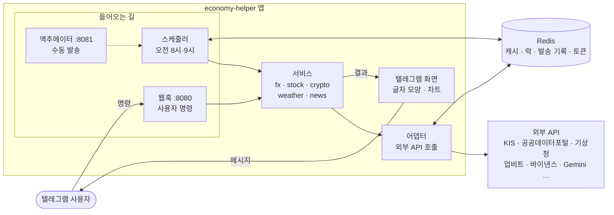
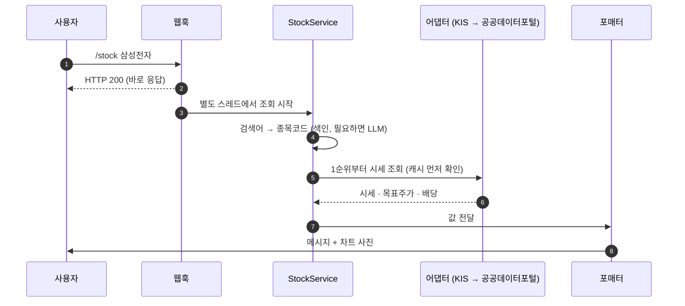
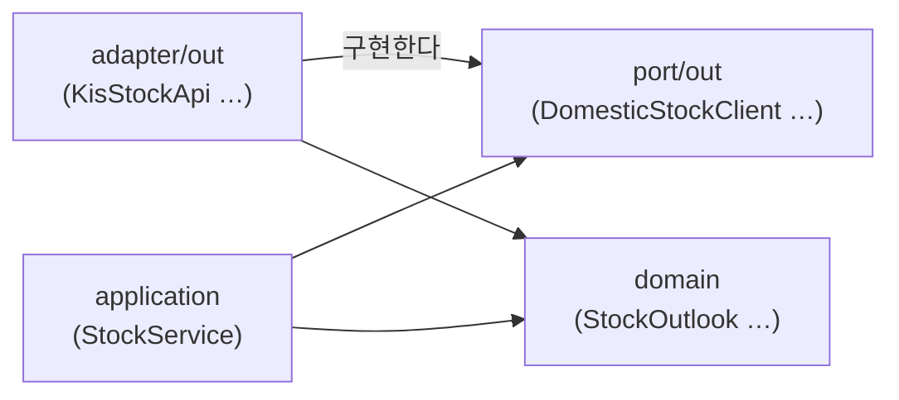
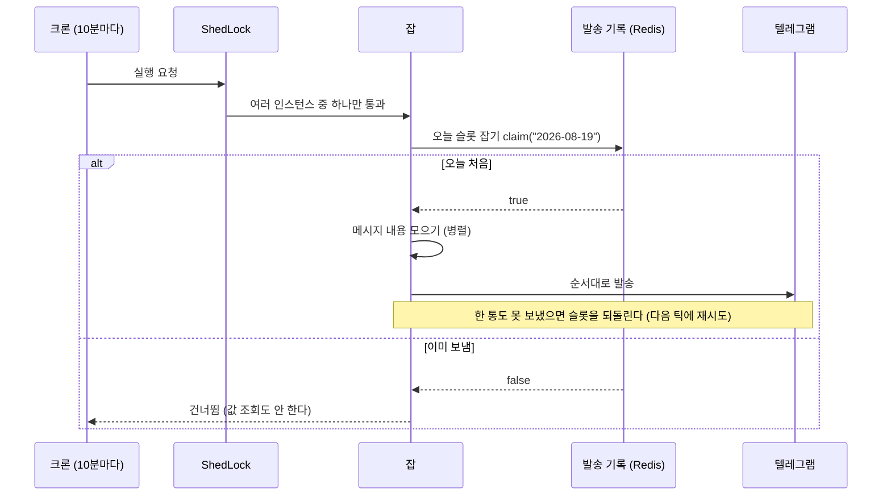
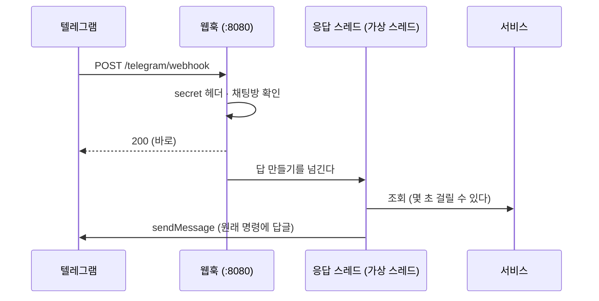
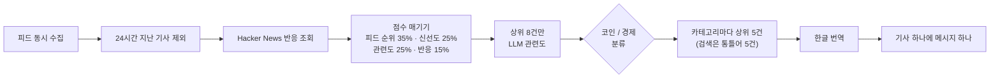
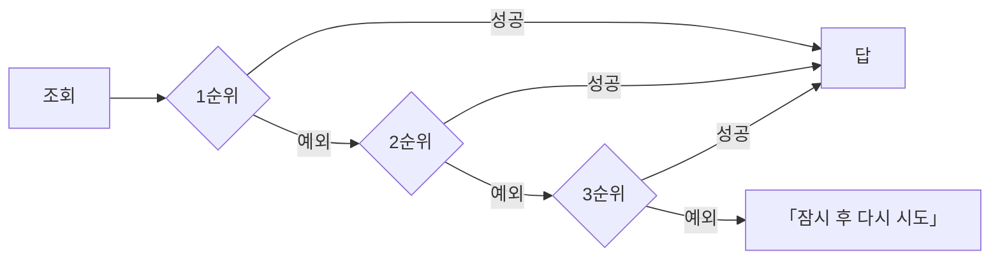

# 설계 문서 (Design Doc)

| | |
|---|---|
| 상태 | 운영 중 |
| 범위 | `backend/` 전체 (프론트엔드는 아직 없음) |
| 함께 볼 문서 | [runbook.md](runbook.md) 운영 · [testing.md](testing.md) 테스트 · [adr/](adr/README.md) 출처별 결정과 실측 |

이 문서는 **어떻게 짰는지, 왜 그렇게 짰는지, 그 대가가 무엇인지**를 적는다.
출처 하나에만 해당하는 결정과 실측 기록은 ADR에 있다.

> **처음 읽는다면** 2장(구조) → 4장(공통 규칙) → 6장(알려진 한계) 순서가 가장 빠르다.

---

## 이 문서에서 쓰는 말

코드 주석에도 같은 말이 나온다.

| 말 | 뜻 |
|---|---|
| **출처** | 값을 가져오는 외부 API 하나 (KIS, 업비트, 기상청 …) |
| **폴백 / 이중화** | 1순위 출처가 실패하면 2순위, 3순위로 넘어가는 것 |
| **보충** | 본 답에 덧붙는 부가 정보 (목표주가·차트·강수 시각). 실패하면 그 줄만 빠진다. 폴백과 다르다 |
| **통** | 텔레그램 메시지 한 개 |
| **무리** | 뉴스 카테고리 (코인 / 경제) |
| **빈손** | 출처가 「결과 없음」을 돌려준 상태 |
| **슬롯** | 정기 발송 하루치의 이름표. 「오늘 보냈나」를 판단하는 단위 (`2026-08-19` 등) |
| **판 번호** | 캐시 이름 끝의 버전 (`geocode-v2`). 규칙을 바꾸면 올린다 — [4.2](#42-캐시) |
| **간격 문** | KIS 호출 사이에 1초를 지키게 하는 장치 (`KisThrottle`) |
| **실물 감사** | 실제 키로 앱을 띄워 진짜 답을 받아 보는 점검 — [runbook](runbook.md#실물-감사) |
| **(종가) · (고시) · (예보)** | 화면에서 값의 성격을 밝히는 꼬리표. 실시간 값이 아니라는 뜻 |

---

## 1. 배경과 목표

재테크에 필요한 값(환율·주식·코인·뉴스·날씨)을 **텔레그램으로 보내 주고(정기 발송), 물으면 답하는(명령)** 봇이다.

**목표**

- 아침 브리핑(오전 9시)과 날씨 알람(오전 8시)을 **하루에 한 번만** 보낸다.
- `/fx` · `/stock` · `/crypto` · `/weather` · `/news` · `/help`에 몇 초 안에 답한다.
- 출처 하나가 죽어도 답은 나간다 — 이중화, 서킷브레이커, 캐시, 락으로 지킨다.
- **틀린 값을 내지 않는다.** 모르는 값은 지어내지 않고, 그 줄을 아예 적지 않는다.

**하지 않는 것**

- 매매·주문, 개인 포트폴리오 관리
- 유료 매체, 페이월 우회, 봇 검문 우회
- 실시간 스트리밍(호가·체결). 모든 값은 조회한 순간의 스냅숏이다.

---

## 2. 구조

### 2.0 전체 그림

앱으로 들어오는 길은 세 개이고, 나가는 길은 외부 API와 텔레그램 두 개다.



외부 API 전체 목록:

| 분야 | 출처 |
|---|---|
| 시세·환율 | KIS(한국투자증권) · 공공데이터포털 · FMP · Polygon · 유럽중앙은행(Frankfurter) · 수출입은행 · 업비트 · 바이낸스 |
| 날씨 | 기상청 · AccuWeather · Open-Meteo |
| 뉴스 | RSS 피드 · Hacker News |
| LLM | Gemini (검색어 해석·번역·관련도) |

### 2.1 명령 하나가 지나가는 길

`/stock 삼성전자`를 예로 들면:



정기 발송도 같은 서비스를 부른다. 다른 점은 시작하는 쪽이 웹훅이 아니라 스케줄러라는 것뿐이다.

### 2.2 패키지 구조 — 폴더가 곧 경계다

헥사고날 구조다. **업무 분야(컨텍스트) × 층**으로 폴더를 나눈다.

```
backend/src/main/java/io/saiden/economyhelper/
│
├── fx/ stock/ crypto/ weather/ news/ translate/    ← 업무 컨텍스트 (모두 같은 모양)
│   ├── domain/                  값 타입과 순수 규칙. Spring을 모른다
│   ├── application/             서비스 — 출처 순서를 정하고 조율한다
│   │   └── port/out/            서비스가 바깥에 요구하는 인터페이스 (= 포트)
│   └── adapter/out/<벤더>/       포트 구현 — 실제 HTTP 호출 (kis, fmp, llm …)
│
├── digest/                      정기 발송 잡 + 수동 트리거(adapter/in/actuator)
├── telegram/                    웹훅(adapter/in/web) · 발송(adapter/out) · 화면(presentation)
│
├── infrastructure/kis, llm/     여러 어댑터가 나눠 쓰는 기술 코드 (KIS 호출 골격, Gemini 전송)
├── shared/domain, support/      누구나 쓰는 값(Price …)과 도구(Failover …)
└── config/                      스프링 조립 — 캐시·회복탄력성·타임아웃·스케줄
```

층 사이의 의존 방향은 이렇다. 화살표는 「안다(import한다)」는 뜻이다.



서비스는 포트(인터페이스)만 알고 어떤 벤더가 뒤에 있는지 모른다. 그래서 벤더를 바꿀 때 어댑터와 순서 목록만 고치면 된다.

**컨텍스트별 구성**

| 컨텍스트 | 서비스 (`application`) | 대표 포트 (`port/out`) | 어댑터 (`adapter/out/…`) |
|---|---|---|---|
| `fx` | `FxService` | `FxRateClient` · `FxDailyBarClient` | `kis` · `frankfurter` · `kexim` |
| `stock` | `StockService` · `StockListings` | `DomesticStockClient` · `UsStockClient` · `UsOutlookClient` · `UsDividendClient` · `ListingSource` | `kis` · `datago` · `fmp` · `polygon` · `llm` |
| `crypto` | `CryptoService` | `UpbitClient` · `BinanceClient` · `CoinResolver` | `upbit` · `binance` · `llm` |
| `weather` | `WeatherService` · `WeatherFacade` | `WeatherClient` · `HourlyPrecipitationClient` · `Geocoder` · `PlaceResolver` | `kma` · `accu` · `openmeteo` · `llm` |
| `news` | `NewsService` · `NewsFacade` · `QueryExpander` | `ArticleFeed` · `ArticleBuzz` · `RelevanceJudge` | `feed` · `hackernews` · `llm` |
| `translate` | `TranslationService` · `QueryTranslationService` | `Translator` · `SearchTermTranslator` · `TranslationCache` | `llm` · `cache` |
| `digest` | `DailyDigestJob` · `WeatherDigestJob` | `SendHistory` · `DigestNotifier` | `redis` (+ `adapter/in/actuator`) |
| `telegram` | — | — | `adapter/in/web` 웹훅·명령 파싱 · `adapter/out` `TelegramClient`·`TelegramDigestNotifier` · `presentation` 포매터·차트 |

`shared`에 있는 것: 값 `Price` · `PercentChange` · `DailyBar` · `DailySeries`, 도구 `Failover` · `Concurrently` · `Fetched` · `Permit` · `FailureReason` · `QueryNormalizer`.

**경계 규칙** — ArchUnit이 컴파일된 코드를 검사한다(`config/ArchitectureTest`가 정본).

| # | 규칙 | 쉽게 말하면 |
|---|---|---|
| 1 | `domain`은 Spring·Jackson과 바깥 층을 모른다 | 도메인은 순수 자바 |
| 2 | `application`은 포트만 안다. 어댑터·화면·인프라·스프링 캐시를 모른다 | 캐시는 어댑터의 `@Cacheable`에. 캐시 미스를 구분해야 하면 포트로 뺀다(`TranslationCache`) |
| 3 | 어댑터 모듈끼리 서로 모른다 (`telegram`은 통째로 한 모듈) | 같이 쓸 코드는 `infrastructure`로 올린다 |
| 4 | 다른 컨텍스트는 `domain`과 서비스로만 부른다 | 남의 어댑터를 직접 부르지 않는다 |
| 5 | 남의 포트는 그것을 구현하는 어댑터만, 그 포트의 계약만큼만 안다 | |
| 6 | `application` 아래 인터페이스는 `port` 아래에만 둔다 | |
| 7 | `shared`·`infrastructure`는 업무 컨텍스트를 모른다. `shared`는 `infrastructure`·`config`도 모른다 | 바닥은 위를 모른다 |
| 8 | 컨텍스트 사이에 순환이 없다 | |

### 2.3 이름 규칙

포트는 `application/port/out`의 인터페이스이고, 이름에 역할을 쓴다(`Port` 접미사를 붙이지 않는다).
다른 컨텍스트가 구현하는 포트도 `port/out`에 둔다. 예: digest의 `DigestNotifier`는 telegram의 `TelegramDigestNotifier`가 구현한다.
digest는 화면과 무관한 `DigestMessage`만 넘기고, 글자 모양·차트·전송(같은 방 발송 간격 포함)은 telegram이 맡는다.

| 접미사 | 뜻 | 예 |
|---|---|---|
| `*Api` | 벤더 하나의 엔드포인트 묶음 (HTTP 그대로). 포트를 직접 구현하기도 한다 | `GeminiApi` · `StockPriceApi` · `KisStockApi` |
| `*Client` | 포트 이름, 또는 그 포트의 벤더 구현 | `FxRateClient`(포트) · `KeximFxClient`(구현) · `TelegramClient` |
| `*Service` | 여러 포트를 순서대로 부르는 이중화 조율자 | `StockService` · `FxService` · `WeatherService` · `CryptoService` |
| `*Facade` | 서비스 위의 단일 진입점. 나중에 REST가 붙어도 텔레그램과 같은 길을 타게 | `NewsFacade` · `WeatherFacade` |

**코드 공유는 벤더 단위까지만 한다.**

- KIS는 환율과 주식이 **같은 앱키·같은 호출 간격·같은 토큰**을 쓴다. 그래서 `infrastructure/kis`의 `KisCall`(간격 지키기 → 요청 → 토큰 가리기 → `rt_cd` 확인)을 함께 쓴다.
- **여러 벤더를 아우르는 공통 베이스 클래스는 만들지 않는다.** 벤더마다 파라미터가 겹치지 않는다.
- **벤더 이름은 어댑터·인프라 패키지에만 나온다.** 벤더를 바꿀 때 고칠 곳이 그 어댑터와 서비스의 순서 목록 한 줄뿐이다.

---

## 3. 흐름

### 3.1 정기 발송 — 하루 한 번만 보내기

크론이 10분마다 잡을 깨우고, 잡은 Redis의 **발송 기록(`SendHistory`)**에 「오늘 보냈나」를 물어본다.
처음이면 보내고, 이미 보냈으면 아무것도 하지 않는다.



| 설계 | 이유 |
|---|---|
| 정각 한 번이 아니라 **두 시간 창 안에서 10분마다** 돈다 (브리핑 9~10시, 알람 8~9시) | 무료 호스트는 쉬면 잠든다. 정각에 프로세스가 없으면 그날 발송이 사라진다. 창을 두면 깨어난 뒤 첫 틱이 보낸다. 대신 여러 번 돌기 때문에 슬롯이 필요하다 |
| **ShedLock과 발송 기록을 둘 다 쓴다** | ShedLock은 두 인스턴스가 *같은 순간* 도는 것을, 발송 기록은 *같은 날* 두 번 보내는 것을 막는다 |
| **슬롯 이름에 접두사를 붙인다** (`DigestSlot`) | 두 잡의 슬롯이 둘 다 `yyyy-MM-dd`면 날씨 알람이 슬롯을 먼저 잡아 브리핑이 통째로 사라진다. 실제로 겪었다 |
| **한 통도 못 보냈을 때만 슬롯을 되돌린다** | 이미 나간 통이 있는데 되돌리면 그 통이 또 나간다. 수집 중 `Error`나 인터럽트가 나도 잡이 `release`하고 다시 던진다 |
| ⚠️ 텔레그램 발송부는 **한 통 보낼 때마다 즉시** 알린다(`onDelivered`) | 결과를 모아서 한꺼번에 돌려주면, 발송 뒤 `Error`가 나는 순간 「보냈다」는 기록이 사라져 슬롯이 풀리고 같은 글이 또 나간다. 한 통이 거절돼도 다음 통은 보낸다(첫 실패만 결과에 남긴다) |

### 3.2 명령 응답 — 웹훅에는 바로 200을 주고, 답은 따로 만든다



- **왜 바로 200인가**: 텔레그램은 웹훅 응답이 늦으면 같은 업데이트를 다시 보낸다. `/news`는 몇 초가 걸린다.
- **대가**: 답을 못 만들어도 텔레그램은 이미 200을 받았으니 다시 보내 주지 않는다. 그래서 실패할 때마다 **사용자에게 보낼 안내 문구**가 따로 있고, 텔레그램 발송은 전달 실패만 재시도한다(429면 `retry_after`만큼 기다렸다 한 번 더).
- **같은 업데이트가 두 번 오면 한 번만 답한다.** 200이 텔레그램에 닿지 못하면 같은 업데이트가 다시 온다. `update_id`를 Redis에 하루 동안 기억해(`ProcessedUpdates`) 두 번째는 200만 주고 넘긴다. Redis가 죽어 있으면 확인 없이 받는다.
- **명령 파싱**
  - `/`로 시작하지 않으면 명령이 아니다 (그룹 대화를 건드리지 않는다).
  - `/명령@다른봇`은 무시한다.
  - 인자가 필요한데 없거나, 인자를 받지 않는 명령에 인자가 오면 사용법을 보여 준다. (`/fx 엔`에 달러 환율로 답하지 않는다.)
- **액추에이터는 8081로 분리한다.** `/actuator/digest`는 구독자 전원에게 즉시 발송하는 버튼이다. 8080에 같이 있으면 아무나 브리핑을 쏠 수 있다.

### 3.3 뉴스 파이프라인



카테고리별 자리 배분은 [ADR-0015](adr/0015-news-ranking-and-categories.md), 검색어 처리는 [ADR-0016](adr/0016-news-search.md)에 있다. 여기는 구조상의 이유만 적는다.

| 설계 | 이유 |
|---|---|
| 가중치는 설정 파일에 둔다 | 실제 발송 결과를 보며 조정할 값이다 |
| LLM 관련도는 상위 8건에만 매긴다 | 전부 넣으면 무료 한도를 다 쓰고, 너무 줄이면 좋은 기사가 빠진다 |
| 기사마다 메시지를 나눈다 | 텔레그램은 링크 미리보기 카드를 메시지 맨 아래에 하나만 붙인다. 여러 기사를 묶으면 첫 기사 밑에 셋째 기사 카드가 붙은 것처럼 보인다 |
| 신선도는 KST 날짜가 아니라 **지난 시간**으로 자른다 | KST 자정은 외국 매체의 하루를 둘로 쪼갠다 |

---

## 4. 공통 규칙

코드를 고칠 때 가장 먼저 확인할 곳이다.

### 4.1 이중화 = 포트 하나 + 순서 목록 하나

```java
interface FxRateClient { FxSource source(); FxRate usdToKrw(); }      // 값을 주거나, 예외를 던진다
private static final List<FxSource> ORDER = List.of(KIS, FRANKFURTER, KEXIM);
this.clients = Failover.order(clients, ORDER, FxRateClient::source);  // shared/support/Failover
```



순서대로 부르는 일은 `Failover`가 하고, **순서 자체는 각 서비스가 정한다.** 로그도 서비스가 남긴다.

| 분야 | 1순위 | 2순위 | 3순위 | 근거 |
|---|---|---|---|---|
| 환율 | 한국투자증권 *(하루 중 변동)* | 유럽중앙은행 *(고시)* | 수출입은행 *(고시)* | [ADR-0002](adr/0002-fx-source-order.md) |
| 국내 시세 | 한국투자증권 *(실시간)* | 공공데이터포털 *(전일 종가)* | — | [ADR-0003](adr/0003-domestic-stock-and-etf.md) |
| 미국 시세 | 한국투자증권 | FMP | — | [ADR-0004](adr/0004-us-quote-and-outlook.md) |
| 날씨 (국내) | 기상청 *(오늘~3일 뒤)* | AccuWeather | Open-Meteo | [ADR-0009](adr/0009-weather-provider-order.md) |
| 날씨 (국외) | AccuWeather | Open-Meteo | — | 〃 |

| 규칙 | 이유 |
|---|---|
| **실패는 빈 값이 아니라 예외로 알린다** | 빈 값을 돌려주면 다음 출처로 넘어가지 않는다 |
| **순서는 서비스가 명시한다** | Spring 주입 순서에 맡기면 클래스 이름만 바꿔도 순서가 뒤집힌다 |
| **성공하면 바로 돌아간다** | 전부 불러 놓고 고르면 이중화가 아니라 *선택*이고, 요청마다 2순위 한도를 쓴다 |
| **제약이 적은 출처를 뒤에 둔다** | 받쳐 주는 쪽이 키를 요구하면, 그 키가 없을 때 이중화가 통째로 사라진다 |
| **못 하는 출처는 아예 부르지 않는다** — 날씨의 `supports(place, period, today)` | 지점이 인자로 있어야 기상청이 「국내만 맡는다」고 말할 수 있다 |
| **서킷브레이커는 출처마다 따로** | 하나로 묶으면 1순위 장애가 폴백까지 끊는다 |
| ⚠️ **보충은 폴백이 아니다** | 목표가·실적발표일·배당, 일봉 차트, 강수 시각은 실패해도 그 줄만 빠지고 답은 나간다. 단, **사용자가 물은 값 자체**를 내는 조회는 보충이 아니다 — 실패하면 예외를 던져 폴백을 일으킨다 |
| **장애와 「결과 없음」을 구분한다** | 출처가 전부 실패하면 「못 찾음」이 아니라 「잠시 후 다시」라고 답한다 |

**대가**: 폴백이 일어나면 **값의 성격이 떨어진다**(실시간 → 전일 종가). 그래서 화면에 출처와 기준 시각을 적는다 — [4.7](#47-값의-성격을-화면까지-나른다).

### 4.2 캐시

**캐시 이름 하나에 타입 하나만 담는다.**
다형 타입 정보(`@class`)를 켜면 `List.of(...)` 같은 불변 컬렉션에는 타입이 안 붙어서, **쓸 때는 되는데 읽을 때 깨진다.** 게다가 Redis에 쓸 수 있는 사람이 임의 클래스를 만들게 할 수도 있다.
대가로 캐시 이름이 많아지고, 등록 누락은 `CacheConfigTest`가 잡는다.

**TTL은 값의 성격에 맞춘다**

| 값 | TTL |
|---|---|
| 현재가 | 10초 ~ 1분 |
| 전일 종가 | 1시간 |
| 종목 목록 | 6시간 |
| 전망(목표주가 등) | 12시간 |
| LLM 해석 | 7일 이상 |

**캐시는 리미터·브레이커보다 바깥에 있어야 한다.**
기본 순서대로 두면 **캐시에 있는 값을 읽어도 리미터 허용량이 줄고**, 브레이커가 열리면 캐시된 값조차 못 읽는다.
그래서 `@EnableCaching(order = LOWEST_PRECEDENCE - 10)`이고, `ResilienceConfigTest`가 순서를 검사한다. 전체 순서는 [4.4](#44-리미터는-앱키-단위-브레이커는-출처-단위-재시도는-폴백-없는-곳만)의 그림 참고.

**캐시는 부가 기능이다 — Redis가 죽어도 답은 나간다.**
`CacheErrorConfig`가 읽기 실패는 캐시 미스로, 쓰기 실패는 건너뛰기로 바꾼다. 캐시를 직접 부르는 곳(`SpringTranslationCache`)도 똑같이 처리한다.

**무엇을 캐시에 담고, 무엇을 안 담나**

| 경우 | 규칙 | 이유 |
|---|---|---|
| `Optional`을 돌려주는 메서드 | 값만 저장하고 `unless = "#result == null"`을 **반드시** 단다 | 빈 Optional은 안 담겨야 LLM 일시 실패가 7일 동안 남지 않는다. `unless`가 없으면 `disableCachingNullValues`가 예외를 호출자까지 올린다 |
| 「없다」 자체가 값인 경우 | Optional 대신 빈 값 객체로 담는다 (`StockOutlook.none` · `Dividend.none()`) | 「의견 낸 증권사 없음」은 12시간 안 바뀌는 **값**이다 |
| 컬렉션·맵을 돌려주는 메서드 | 빈 것은 안 담는다 (`unless = "#result.isEmpty()"`) | 상대가 한순간 빈 결과를 주면 TTL 내내 남는다. 예외: 공공데이터포털 `searchBy*` — 열흘을 되짚어도 없으면 정말 없는 것이다 |
| LLM이 막혔을 때의 대체값 | 안 담는다 | 「전부 통과」 관련도, 번역 안 된 원문 같은 강등 결과다 |

#### 판 번호 — 긴 TTL 캐시가 고침보다 오래 산다

실제 사고: `/weather 미금`을 고쳤는데도 옛 프롬프트로 만든 해석(7일)과 옛 규칙으로 고른 지오코딩(30일)이 캐시에 남아 200km 떨어진 곳 날씨를 답했다. Redis가 AOF라 재시작해도 안 지워진다.

1. **판 번호를 올리는 때는 둘이다** (`CacheNames`). 옛 키는 아무도 안 읽으니 TTL이 지나면 사라진다.
   - **규칙이 바뀌었다** — 파생 규칙이나 프롬프트를 고쳤을 때. `geocode-v2`, `stock-resolve-v5`처럼
     **우리 규칙으로 만든 값**을 담는 캐시(지오코딩·해석기)가 여기다.
   - **담는 모양이 바뀌었다** — 수명이 짧아도 올린다. 롤링 배포 중에는 옛 인스턴스가 담은 옛 모양을
     새 인스턴스가 **캐시 적중**으로 읽어 필드가 `null`이 되거나 역직렬화가 터진다.
     `crypto-price-v2`·`binance-price-v2`와 환율 셋(`fx-v2`·`fx-kexim-v2`·`fx-kis-v2`)이 그래서 붙었다 —
     전부 상대가 준 시세인데도 판이 있는 이유다.

   둘 다 아니면 안 매긴다. **담는 모양이 그대로인 한** 시세나 상대가 준 값을 담는 캐시(전망)에는 매기지 않는다.
2. **파생된 값은 캐시에 담지 않는다.** 화면 이름은 읽을 때 정하고(`GeoLocation.labelledFor`), 뉴스 카테고리도 읽을 때 계산한다.

값 객체(`Price` · `PercentChange`)는 캐시에 **숫자 그대로** 저장된다(`config/ValueObjectModule`). 항목 하나만 지우는 법은 [runbook.md](runbook.md#캐시-비우기).

### 4.3 타임아웃은 호스트별로 정한다

Spring Boot 4에는 직접 만든 `RestClient`에 이름별 타임아웃을 거는 방법이 없다. 그래서 `economy-helper.http-timeouts`에 호스트별로 적고, `HttpTimeouts`가 `RestClientCustomizer`로 팩터리를 바꿔 끼운다.

값은 실측 응답 시간(p50)에서 정했다.

| 호스트 | 실측 p50 | read 타임아웃 |
|---|---|---|
| 업비트 · 바이낸스 · 유럽중앙은행 | 37ms · 86ms · 142ms | 3초 |
| Open-Meteo | 0.9 ~ 1.1초 | 6초 |
| KIS · FMP · 텔레그램 | — | 10초 |
| **Gemini** | — | **30초** (생성은 조회가 아니다) |

⚠️ **호스트가 같다고 출처가 같은 것은 아니다.** `apis.data.go.kr` 하나에 금융위 주식시세·ETF와 기상청 예보가 다 있다. 타임아웃은 하나로 맞지만 **브레이커는 나눈다**(`dataGo` / `dataGoEtf` / `weatherKma`). 커넥션 풀을 공유하게 되면서 KIS 토큰 발급에도 간격 문을 달았다.

### 4.4 리미터는 앱키 단위, 브레이커는 출처 단위, 재시도는 폴백 없는 곳만

호출 하나는 바깥에서 안쪽으로 이 순서를 지난다.

```
요청 → 캐시 → 재시도 → 서킷브레이커 → 리미터 → 외부 API
```

| 장치 | 단위 | 이유 |
|---|---|---|
| **리미터** | 앱키(계정) | 한도가 계정에 걸린다. KIS 환율과 주식은 리미터 `kis` 하나를, 공공데이터포털 주식·ETF·기상청은 `dataGo` 하나를 나눠 쓴다 |
| **브레이커** | 출처 | ETF는 활용신청이 따로라 신청 전에는 매번 403이다. 주식과 브레이커를 같이 쓰면 그 403이 주식 2순위까지 끊는다 |

**주의할 점**

- 리미터 거절은 브레이커 실패로 세지 않는다. 우리가 건 제한이지 상대 장애가 아니다.
- 같은 상태 코드도 출처마다 뜻이 다르다. 텔레그램·Gemini의 429는 잠깐 기다리면 풀려서 브레이커에서 뺐지만, 바이낸스의 418·429는 IP 밴으로 이어진다([ADR-0008](adr/0008-crypto.md)).
- ⚠️ `ignoreExceptions`·`retryExceptions`는 `baseConfig`의 값을 **덮어쓴다**. 이어 붙이지 않는다.
- ⚠️ **`retry`의 `configs.default`는 자동으로 안 붙는다** — 인스턴스마다 `baseConfig: default`를 적어야 한다. 빠뜨리면 라이브러리 기본(세 번, `retryExceptions` 비어 있음 = **모든 예외**)으로 돌고, `ignoreExceptions`도 안 붙어 리미터 거절과 브레이커 열림까지 다시 부른다. `ratelimiter`에는 아예 `configs`가 없다 — 선언 안 한 리미터는 아무것도 막지 않는다.

**재시도는 이 셋에 모두 해당하지 않을 때만 건다.**

1. 한도가 있다 → 안 건다
2. 다음 출처(폴백)가 있다 → 안 건다
3. 실패가 영구적인 경우가 흔하다 → 안 건다

그래서 재시도가 걸린 곳은 Open-Meteo 계열 · 업비트 · 바이낸스 · 유럽중앙은행 · 텔레그램 · RSS 피드뿐이다(정본은 `application.yml`).

| 재시도 안 거는 곳 | 이유 |
|---|---|
| KIS (주식·환율·토큰) | 500이 대개 영구 실패다(`EGW00121`·`EGW00304`). 초당 한도 초과(`EGW00201`)만 `KisCall`이 한 번 더 부른다 — [ADR-0001](adr/0001-kis-calls.md) |
| FMP · AccuWeather · 수출입은행 · 공공데이터포털 | 하루 한도가 있다. AccuWeather의 503은 곧 「한도 소진」이다 |
| 기상청 | 폴백이 둘 있다 |
| Gemini | 리미터가 60초에 12회다. 재시도가 리미터 바깥이라 시도마다 허용량을 더 쓴다. 강등 경로가 이미 있다 |
| Hacker News | 브레이커를 일부러 빨리 열고 오래 닫아 두었다 |

- **재시도할 예외를 적는다(뺄 것을 적지 않는다).** `retryExceptions`에는 5xx와 `ResourceAccessException`만 적는다.
- **재시도는 브레이커 바깥이어야 한다**(기본 순서가 이미 그렇다). 안쪽이면 「두 번 실패하고 세 번째 성공」하는 상대 때문에 브레이커가 영영 안 열린다. 세 번째에 성공한 호출은 `ResilienceConfig`가 WARN 로그로 남긴다.

### 4.5 병렬 처리는 가상 스레드로, 상대 보호는 리미터로

기다리는 작업을 병렬로 돌리면 걸리는 시간이 「합」이 아니라 「가장 긴 것」이 된다.

- **스레드 풀 크기를 정하지 않는다.** 동시에 도는 것은 많아야 매체 수 정도이고, 가상 스레드는 싸다.
- **상대 API 보호를 스레드 수로 하지 않는다.** 그건 리미터의 일이다. 두 곳에 나눠 두면 한쪽만 고쳐진다.
- **`Concurrently`는 실패를 숨기지 않는다.** 「하나가 죽어도 나머지는 보낸다」를 정하는 건 호출하는 쪽이다.

병렬로 도는 곳: FMP 목표가와 실적발표일, HN 반응(도메인별), 검색어 번역(단어별), 검색 답의 차트(글 발송과 동시), 국외 날씨의 시간별 강수.

- 텔레그램 발송 간격은 「메시지 사이에 1초 쉬기」가 아니라 **같은 방에서 발송 시작 사이 1초**다.
- KIS는 간격 문이 호출 사이 1초를 지키므로 병렬로 돌려도 빨라지지 않는다.

### 4.6 LLM은 해석만 하고, 확정하지 않는다

| 쓰는 곳 | LLM에게 맡기는 것 | 맡기지 않는 것 (누가 확정하나) |
|---|---|---|
| `StockResolver` | 약칭·자연어 → 종목코드 후보, 국내 ETF 상장명 소리 맞추기 | 실재 여부 → 시세 API와 종목 색인(`StockListings`) |
| `WeatherResolver` | 지명·기간 | 좌표와 실재 여부 → 지오코딩 |
| `CryptoResolver` | 코인 이름 | 상장 여부 → 업비트 |
| `RelevanceScorer` | 재테크 관련도 | 순위 → 관련도는 점수 네 항목 중 하나일 뿐 |

- **왜**: LLM이 지어낸 값이 구조적으로 걸러진다. 지어낸 종목코드는 조회 결과가 비어서 버려진다.
- **상대적인 표현을 날짜로 받지 않는다.** `내일`을 날짜로 받으면 7일 캐시에 남아, 내일이 영원히 그 날짜가 된다. `offsetDays`(며칠 뒤)로 받고 날짜는 코드가 그날 계산한다.
- **대응표를 LLM에게 묻지 않는다.** 업종코드(코스피 `0001`), KIS 심볼(`^IXIC` → `COMP`)은 확인된 사실이라 설정 파일에 둔다.
- **대가**: LLM이 죽으면 검색 품질이 떨어진다. 그래서 마지막에 **원문 그대로** 한 번 더 찾는다.

### 4.7 값의 성격을 화면까지 나른다

모든 메시지는 **제목 / 값 / 출처 / 기준 시각**의 같은 뼈대를 쓴다.

```
<b>증시</b>                      ← 제목: 명령 이름 (검색어는 붙이지 않는다)

<b>국내</b>                      ← 카테고리: 지역으로 나눈다

삼성전자                          ← 값: 종목 하나가 블록 하나
254,000 KRW
🔵 -5.40%

한국투자증권                      ← 출처: 여러 개면 한 줄에 하나씩
2026년 8월 19일(수) 09:00:12     ← 기준: 실시간이면 시각, 종가면 날짜 + (종가)
```

| 규칙 | 이유 |
|---|---|
| **출처를 적는다** | 폴백이 일어나면 값의 성격이 떨어진다. 숨기면 고장이 아니라 거짓말이 된다 |
| **카테고리는 지역(`StockQuote.Market`)으로 나눈다** | `realtime` 여부로 나누면, 국내에 실시간이 붙는 순간 삼성전자가 「미국」에 찍힌다 |
| **장이 닫혀 있으면 (종가)다** | 주말·휴일에 마지막 거래일 값에 지금 시각을 찍으면 실시간처럼 보인다 |
| **못 구한 값을 0으로 찍지 않는다** | `0.00%`는 「보합」이라는 값이다. 원화 환산이 0으로 반올림되면 유효숫자 두 자리를 남긴다 |
| **자릿수를 맞춘다** | 폭이 좁은 온도·강수량은 자릿수를 고정하고, 범위가 넓은 가격(89,848,000 ~ 0.5)은 그대로 둔다 |

### 4.8 벤더 날짜는 STRICT로 읽는다

`DateTimeFormatter.ofPattern`의 기본은 SMART 모드다. 상대가 `2026/02/31`을 보내면 예외 없이 **조용히 2월 28일**이 된다.

- ⚠️ **`yyyy`와 STRICT는 같이 쓸 수 없다.** `yyyy`는 연호 기준이라 파싱이 통째로 실패한다. 그래서 `uuuu`로 바꾸고, 규칙을 모든 포매터에 건다(출력 결과는 같다).
- **검사는 `StrictDateParsingTest`가 한다.** 컴파일된 클래스에서 포매터 객체를 꺼내 확인하므로, 포매터는 정적 필드로 선언한다.
- 미리 정의된 ISO 포매터(`LocalDate.parse` · `BASIC_ISO_DATE`)는 원래 STRICT다.

---

## 5. 대안과 대가

| 고른 것 | 고른 이유 | 다른 걸 골랐다면 | 치른 대가 |
|---|---|---|---|
| **텔레그램 봇** | 봇 API가 거의 무료이고 푸시도 공짜 | 자체 앱이면 푸시 인프라와 스토어 심사가 필요 | 화면이 텔레그램 HTML 일부로 제한된다 |
| **웹훅** (폴링 대신) | 폴링은 프로세스가 늘 떠 있어야 한다 | 서버가 잠들면 명령이 아예 안 온다 | 공개 HTTPS 주소와 시크릿 헤더 검증이 필요 |
| **Redis 하나에 캐시·락·발송 기록·토큰·쿼터** | 저장소가 늘면 비용과 장애 지점이 는다 | 별도 DB면 스키마·마이그레이션이 붙는다 | Redis가 죽으면 락과 발송 기록도 같이 죽는다. KIS 토큰만 프로세스 안에 사본을 둔다 |
| **무료로 읽히는 매체만** | 링크를 눌러도 못 읽는 기사는 답이 아니다 | 커버리지는 넓어진다 | 통신사 자리를 AP가 대신한다 — [ADR-0014](adr/0014-news-sources.md) |
| **동명 종목은 시가총액으로 고른다** (LLM 대신) | API가 시총을 같이 줘서 공짜 | LLM 비용과 환각 | `네이버`(상장명 `NAVER`) 같은 경우만 LLM이 메운다 |
| **날씨 알람 좌표를 설정에 고정** | 지오코딩이 역 이름을 못 찾는다 | 매일 엉뚱한 동네 날씨 | 지역을 바꾸려면 배포해야 한다 — [ADR-0013](adr/0013-weather-alarm.md) |
| **가상 스레드** | 스레드 대부분이 외부 API를 기다린다 | 톰캣 200 스레드가 상한 | JDK 21 고정 (툴체인·CI·Docker 베이스) |
| **KIS 모의투자 계정** | 실전 계좌 없이 시세를 쓸 수 있다 | 실전은 도메인·앱키가 다르고 계좌가 필요 | 실전 전용 엔드포인트를 못 쓴다 — [ADR-0001](adr/0001-kis-calls.md) |

---

## 6. 알려진 한계

- **단위 테스트·골든이 통과해도 이어 붙이면 틀릴 수 있다.**
  골든은 우리가 만든 픽스처를 그리고, 운영은 상대가 준 값을 그린다. 그래서 실제 키로 실제 입력을 넣어 보는 **실물 감사**([runbook.md](runbook.md#실물-감사))가 따로 필요하고, **캐시가 빈 상태에서** 해야 한다.
- **중복 발송을 완전히 막지는 못한다.** 비영속 Redis가 발송 직후 비면 「오늘 안 보냄」으로 보인다. 발송 창을 두 시간으로 제한한 것이 방어책이다.
- **브리핑이 중간에 죽으면 남은 메시지를 다시 보내지 않는다.** 한 통이라도 나갔으면 슬롯을 잡은 채로 둔다.
  남은 것만 다시 보내려면 메시지 단위 발송 기록이 필요한데, 그 기록이 어긋나면 구독자 전원에게 중복이 나간다.
  빠진 메시지는 로그와 `GET /actuator/digest`로 보이고, 필요하면 사람이 판단해 `force`로 보낸다 (2026-10-03 결정).
- **KIS 앱키가 없으면 브리핑이 헛호출로 간격 문을 기다린다.** 호출 사이 1초씩 늦어진다.
- **KIS의 초당 한도는 리미터로 표현할 수 없다.** 「호출 사이 몇 초」 방식이라 `KisThrottle`이 지킨다. 실전 계정으로 옮겨 간격이 줄면 재시도 계산을 다시 본다.
- **미국 종목의 2순위는 사실상 없다.** FMP 무료 티어는 허용된 심볼만 준다. 미국 목표가·실적발표일에도 2순위가 없다.
- **Gemini 무료 한도(60초에 12회)가 실제 병목이다.** 브리핑 한 번에 9회를 써서 여유가 3회다. 넘치면 번역은 원문으로, 검색어 해석은 원문 검색으로 조용히 강등된다.
- **프론트엔드·REST API·애드센스·k8s는 아직 없다.** HTTP 입구는 웹훅 하나다. `NewsFacade`·`WeatherFacade`가 단일 진입점이라 컨트롤러만 얹으면 된다.
- **안 하기로 한 구조 정리** (한 번씩 들여다보고 닫았다 — 다시 밟지 않으려고 이유를 남긴다)
  - **벤더 요청 골격(DataGo·KMA·Open-Meteo) 합치기 — 안 한다.** 셋은 이미 각자 벤더 안에서
    합쳐져 있고, 겹치는 것이 없다: DataGo는 문자열 URI 조립 + 서비스키 재인코딩 금지 + 10일 되짚기 +
    `Response<T>` 봉투, KMA는 `Header` 봉투 + HTTP 200 에러, Open-Meteo는 `UriBuilder` +
    `timezone=auto`다. 합치려면 [2.3](#23-이름-규칙)의 「여러 벤더를 아우르는 공통 베이스 클래스는
    만들지 않는다」와 경계 규칙 3을 **둘 다** 고쳐야 한다. 겹치지 않는 것을 공통 상위로 올리는 것은
    중복보다 비싸다.
  - **`*Source` 열거형 통합 — 안 한다.** 공통분모가 `displayName()` 하나뿐이고(나머지는
    `NewsSource.owns`·`WeatherSource.forecast`·`FxSource.intraday`처럼 전부 컨텍스트 고유),
    **그 공통분모를 쓸 소비자가 없다.** 출처를 일반적으로 다루는 유일한 자리인 `Failover.order`는
    이미 `Function<C,S>`로 받고 `order`·`unordered` 호출 여덟 곳이 전부 컨텍스트별 메서드 참조를 넘긴다. 공통
    인터페이스를 뽑으면 사용처가 0인 추상화가 된다.
  - `KisStockApi`를 시세/일봉으로 나누기 — 한 엔드포인트가 시세와 일봉을 같이 준다.
- **설정은 레코드 한 경로로 읽는다.** `@Value` 66자리를 `EconomyHelperProperties`의 중첩 레코드로
  옮겼다(2026-10-07). 기본값은 `@DefaultValue`가 그대로 들고, 기본값이 없던 값(각 출처의
  `base-url`과 `gemini.model`)은 **빠져도 기동이 멈추지 않고 `null`이 흘러간다** —
  플레이스홀더가 못 풀려 터지던 자리를 `EconomyHelperPropertiesTest`가 대신 지킨다
  (`cache-ttl`을 `CacheConfigTest`가, 타임아웃 호스트를 `HttpTimeoutsTest`가 지키는 것과 같다).
