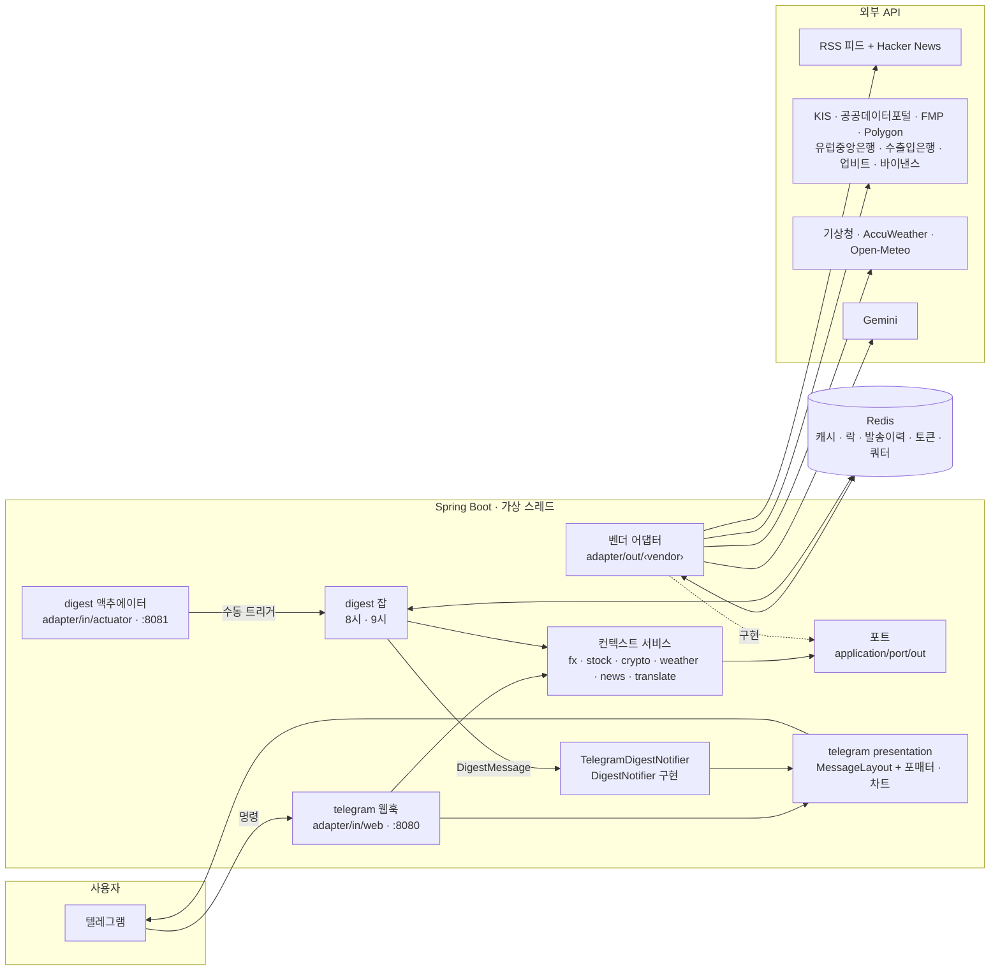
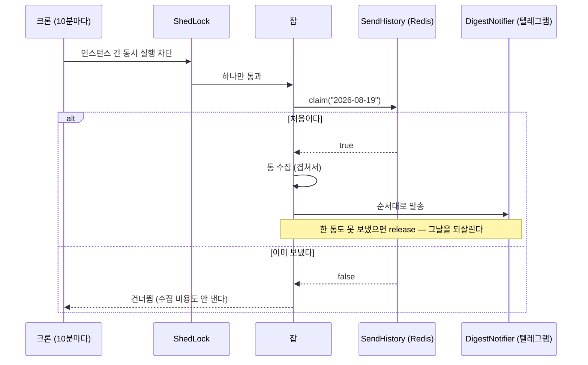
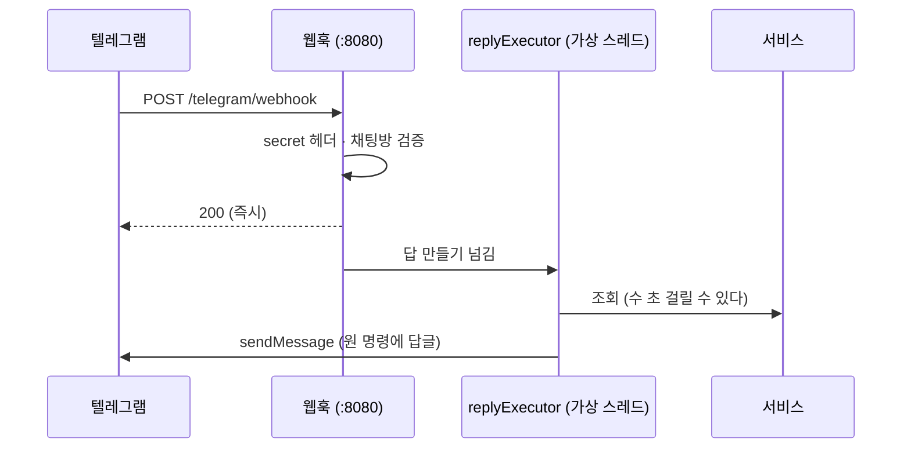
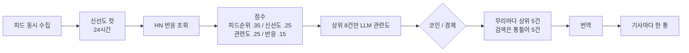

# Design Doc — economy-helper

| | |
|---|---|
| 상태 | 운영 중 |
| 범위 | `backend/` 전체 (프론트엔드는 미구현) |
| 함께 볼 것 | [runbook.md](runbook.md)(어떻게 돌리나) · [testing.md](testing.md)(어떻게 지키나) · [adr/](adr/README.md)(출처별 결정과 실측) |

이 문서는 **구조와 그 이유, 그리고 대가**를 적는다. 출처 하나에 매인 결정과 실측은 ADR에 둔다.
새로 온 사람은 **2 → 4 → 6** 순으로 읽으면 가장 빠르다.

---

## 1. 배경과 목표

재테크에 필요한 값(환율·주식·코인·뉴스·날씨)을 **텔레그램으로 밀어 주고(정기 발송), 물으면 답하는(명령)** 봇이다.

**목표**

- 아침 브리핑(오전 9시)과 날씨 알람(오전 8시)을 **하루 한 번만** 보낸다.
- `/fx` · `/stock` · `/crypto` · `/weather` · `/news` · `/help`에 수 초 안에 답한다.
- 출처 하나가 죽어도 답이 나간다 — 이중화 · 서킷브레이커 · 캐시 · 락.
- **틀린 값을 내지 않는다.** 모르는 것은 지어내지 않고 줄을 안 적는다.

**비목표**

- 매매·주문, 개인 포트폴리오.
- 유료 매체·페이월 우회·봇 검문 우회.
- 실시간 스트리밍(호가·체결). 값은 조회 시점 스냅숏이다.

---

## 2. 구조



### 2.1 패키지가 곧 경계다 (헥사고날 — 컨텍스트 × 층)

`backend/src/main/java/io/saiden/economyhelper/` 아래가 **컨텍스트 × 층**으로 갈린다.

| 컨텍스트 | `application` (서비스) | `application/port/out` (대표) | `adapter/out/‹vendor›` |
|---|---|---|---|
| `fx` | `FxService` | `FxRateClient` · `FxDailyBarClient` | `kis` · `frankfurter` · `kexim` |
| `stock` | `StockService` · `StockListings` | `DomesticStockClient` · `UsStockClient` · `UsOutlookClient` · `UsDividendClient` · `ListingSource` | `kis` · `datago` · `fmp` · `polygon` · `llm` |
| `crypto` | `CryptoService` | `UpbitClient` · `BinanceClient` · `CoinResolver` | `upbit` · `binance` · `llm` |
| `weather` | `WeatherService` · `WeatherFacade` | `WeatherClient` · `HourlyPrecipitationClient` · `Geocoder` · `PlaceResolver` | `kma` · `accu` · `openmeteo` · `llm` |
| `news` | `NewsService` · `NewsFacade` · `QueryExpander` | `ArticleFeed` · `ArticleBuzz` · `RelevanceJudge` | `feed` · `hackernews` · `llm` |
| `translate` | `TranslationService` · `QueryTranslationService` | `Translator` · `SearchTermTranslator` · `TranslationCache` | `llm` · `cache` |
| `digest` | `DailyDigestJob` · `WeatherDigestJob` | `SendHistory` · `DigestNotifier` | `redis` (+ `adapter/in/actuator`) |
| `telegram` | — | — | `adapter/in/web`(웹훅·명령 파싱) · `adapter/out`(`TelegramClient`·`TelegramDigestNotifier`) · `presentation`(포매터·차트) |

각 컨텍스트의 `domain`에는 값 타입과 순수 규칙이 산다(`StockOutlook`·`HalfDays`·`NewsCategory`…). 컨텍스트 밖에 셋이 더 있다.

| 패키지 | 뜻 |
|---|---|
| `shared/domain` · `shared/support` | 누구나 쓰는 바닥 — 값(`Price`·`PercentChange`·`DailyBar`·`DailySeries`)과 기계(`Failover`·`Concurrently`·`Fetched`·`Permit`·`FailureReason`·`QueryNormalizer`) |
| `infrastructure/kis` · `infrastructure/llm` | **어댑터끼리 나눠 쓰는 기술 인프라** — KIS 호출 골격·헤더·간격 문·토큰, Gemini 전송과 JSON 해석 |
| `config` | 조립 — 캐시·회복탄력성·타임아웃·스케줄·동시성·프로퍼티 |

**경계는 ArchUnit이 바이트코드로 센다** — 정본은 `config/ArchitectureTest`다.

1. `domain`은 Spring·Jackson과 바깥 층(`application`·`adapter`·`presentation`·`infrastructure`·`config`)을 모른다.
2. `application`은 포트만 안다 — `adapter`·`presentation`·`infrastructure`와 스프링 캐시를 모른다(캐시는 어댑터의 `@Cacheable`, 미스를 가려야 하면 포트 — `TranslationCache`).
3. 어댑터 모듈(`‹ctx›.adapter.‹in|out›.‹vendor›`, `telegram`은 통째로 한 모듈)끼리 서로 모른다 — 나눠 쓸 것은 `infrastructure`로 올린다.
4. 다른 컨텍스트는 `domain`과 `application`의 서비스로만 부른다.
5. 남의 `port`는 **그것을 구현하는 어댑터가, 구현하는 포트의 계약만큼만** 안다.
6. `application` 아래 인터페이스는 `port` 아래에만 둔다.
7. `shared`와 `infrastructure`는 업무 컨텍스트를 모르고, `shared`는 `infrastructure`·`config`도 모른다.
8. 컨텍스트 사이에 순환이 없다.

### 2.2 이름이 역할을 말한다

포트는 `application/port/out`의 인터페이스이고 이름은 역할이다(`Port` 접미사를 붙이지 않는다). 다른 컨텍스트가
구현하는 포트도 `port/out`에 둔다 — `DigestNotifier`의 구현(`TelegramDigestNotifier`)은 `telegram`에 있다.
digest는 표현 중립 `DigestMessage`만 넘기고 포매팅·차트·전송(같은 방 간격 포함)은 텔레그램이 맡는다.

| 접미사 | 뜻 | 예 |
|---|---|---|
| `*Api` | 한 벤더의 엔드포인트 묶음 — 날 HTTP. 포트를 곧장 구현하기도 한다 | `GeminiApi` · `StockPriceApi` · `KisStockApi` |
| `*Client` | 포트 이름이거나 그 벤더 구현 | `FxRateClient`(포트) · `KeximFxClient`(구현) · `TelegramClient`(창구) |
| `*Service` | 포트 목록 위의 이중화 조율자 | `StockService` · `FxService` · `WeatherService` · `CryptoService` |
| `*Facade` | 서비스 위의 단일 진입점 — REST가 붙는 날 텔레그램과 갈리지 않게 | `NewsFacade` · `WeatherFacade` |

**공유는 벤더 단위까지만 한다.** KIS는 환율과 증시가 **한 앱키·한 간격 문·한 토큰**이라 `infrastructure/kis`의
`KisCall`(`pace → 요청 → 토큰 가리기 → rt_cd`)을 나눠 쓴다. **여러 벤더를 아우르는 공통 베이스는 만들지 않는다** —
파라미터가 안 겹친다. **벤더 이름은 어댑터·인프라 패키지에만 산다** — 벤더를 갈아 끼울 때 고칠 곳이 그 어댑터와
서비스의 순서 목록 한 줄로 끝난다.

---

## 3. 흐름

### 3.1 정기 발송 — 슬롯이 「하루 한 번」을 보장한다



- **크론이 정각 한 번이 아니라 두 시간 창 안에서 10분마다다**(브리핑 9~10시, 알람 8~9시). 무료 호스트는 무활동으로
  잠든다. 정각에 프로세스가 없으면 그 크론은 영영 안 돈다 — 창을 두면 깨어난 뒤 첫 틱이 보낸다. 대가로 크론이 여러 번
  돌아 슬롯이 필요하다.
- **ShedLock과 `SendHistory`는 역할이 다르다.** ShedLock은 두 인스턴스가 **같은 순간** 도는 것을, `SendHistory`는
  **예정된 슬롯**당 한 번을 막는다. 둘 다 있어야 한다.
- **슬롯 이름에 접두사를 붙인다**(`DigestSlot`이 요구한다). 두 잡의 슬롯이 둘 다 `yyyy-MM-dd`라 접두사가 없으면
  날씨 알람이 슬롯을 잡아 브리핑이 통째로 사라진다 — 겪은 사고다.
- **한 통도 못 보냈을 때만 슬롯을 되돌린다.** 나간 통이 있는데 풀면 그것들이 다시 나간다. 수집 중 `Error`·인터럽트도
  같다 — 잡이 `release`하고 다시 던진다.
- ⚠️ 창구는 글이 나갈 때마다 곧바로 알린다(`onDelivered`). 결과를 한꺼번에 돌려주면 글이 나간 뒤 새는 `Error`에
  「나갔다」가 사라져 슬롯이 풀리고 같은 글이 또 나간다. 글 하나가 거절돼도 뒤의 글은 보낸다(첫 실패만 결과에 남는다).

### 3.2 명령 응답 — 요청 스레드에서 답을 만들지 않는다



- **왜**: 텔레그램은 웹훅 응답을 기다리고 **늦으면 같은 업데이트를 다시 보낸다.** `/news`는 수 초가 걸린다.
- **대가**: 답을 못 만들어도 텔레그램은 200을 이미 받았다 — 재시도가 없다. 그래서 실패 경로마다 **사용자에게 나가는
  안내 문구**가 따로 있고, 텔레그램 발송은 닿지 못한 것만 재시도한다(429는 `retry_after`를 지켜 한 번 더).
- **명령 파싱**: `/`로 시작하지 않으면 명령이 아니다(그룹 대화를 오염시키지 않는다). `/명령@다른봇`은 무시한다.
  인자가 필요한데 없거나, 인자를 안 받는 명령에 인자가 오면 사용법을 띄운다(`/fx 엔`을 달러로 답하지 않는다).
- **액추에이터를 8081로 뗀다.** `/actuator/digest`는 구독자 전원에게 즉시 방송을 날리는 트리거다. 8080에 함께 있으면
  외부 누구나 브리핑을 쏠 수 있다.

### 3.3 뉴스 파이프라인



무리 할당·섞기·「모자란 무리는 안 메운다」는 [ADR-0015](adr/0015-news-ranking-and-categories.md), 검색어 처리는
[ADR-0016](adr/0016-news-search.md)에 있다. 여기는 구조의 이유만 적는다.

- **가중치는 설정에 뒀다** — 실제 발송 결과를 보고 재조정하는 값이라 코드 밖에 있어야 한다.
- **LLM은 상위 8건에만 태운다.** 전부 넣으면 무료 티어를 태우고, 너무 좁히면 진짜 기사가 빠진다.
- **기사마다 통을 쪼갠다.** 텔레그램이 미리보기 카드를 **통 맨 아래**에 하나만 붙여서, 묶으면 첫 기사 카드가
  셋째 기사 것처럼 보인다.
- **신선도를 KST 날짜가 아니라 경과 시간으로 자른다.** KST 자정은 외국 매체의 하루를 둘로 쪼갠다.

---

## 4. 횡단 규칙

고칠 때 가장 먼저 볼 곳이다.

### 4.1 이중화는 포트 하나 + 순서 목록 하나

```java
interface FxRateClient { FxSource source(); FxRate usdToKrw(); }   // 값을 주거나 던진다
private static final List<FxSource> ORDER = List.of(KIS, FRANKFURTER, KEXIM);
this.clients = Failover.order(clients, ORDER, FxRateClient::source);   // shared/support/Failover
```

**기계는 `Failover`가 하고 정책은 서비스가 든다.** 순서 목록은 각 서비스에 남고 로그도 호출부가 남긴다.

| 도메인 | 1순위 | 2순위 | 3순위 | 근거 |
|---|---|---|---|---|
| 환율 | 한국투자증권 *(하루 중 움직임)* | 유럽중앙은행 *(고시)* | 수출입은행 *(고시)* | [ADR-0002](adr/0002-fx-source-order.md) |
| 국내 시세 | 한국투자증권 *(실시간)* | 공공데이터포털 *(전일 종가)* | — | [ADR-0003](adr/0003-domestic-stock-and-etf.md) |
| 미국 시세 | 한국투자증권 | FMP | — | [ADR-0004](adr/0004-us-quote-and-outlook.md) |
| 날씨 (국내) | 기상청 *(오늘~+3일)* | AccuWeather | Open-Meteo | [ADR-0009](adr/0009-weather-provider-order.md) |
| 날씨 (국외) | AccuWeather | Open-Meteo | — | 〃 |

- **빈 값이 아니라 예외로 실패한다.** 빈 값을 돌려주면 다음 출처가 시도되지 않는다.
- **순서를 서비스가 정한다.** Spring 주입 순서에 딸려 가면 클래스 이름을 바꾸다 순서가 뒤집힌다.
- **성공하면 즉시 반환한다.** 전부 불러 고르면 이중화가 아니라 *선택*이고, 요청마다 2순위 한도를 태운다.
- **제약이 적은 쪽이 뒤에 선다.** 받쳐 주는 쪽이 키를 요구하면 그 키가 없을 때 이중화가 통째로 없다.
- **못 하는 출처는 부르지 않는다** — 날씨의 `supports(place, period, today)`. 지점이 인자에 있어야 기상청이
  「국내만 맡는다」를 말할 수 있다.
- **브레이커는 출처마다 따로 연다.** 묶으면 1순위 장애가 폴백까지 끊는다.
- ⚠️ **「보충」은 폴백이 아니다** — 실패해도 답을 죽이지 않고 그 줄만 빠진다. 전망(목표가·실적발표일·배당) · 일봉
  차트 · 강수 시각이 그렇다. **사용자가 물은 날·값 자체를 내는 조회는 보충이 아니다** — 실패하면 던져서 폴백을 일으킨다.
- **장애와 빈손을 가른다.** 출처가 전부 실패하면 「못 찾음」이 아니라 「잠시 후 다시」다.

**대가**: 폴백이 일어나면 **값의 성격이 내려앉는다**(실시간 → 전일 종가). 화면이 출처와 기준으로 밝힌다 — 4.7.

### 4.2 캐시

**이름 하나에 타입 하나.** 다형 타입 정보(`@class`)를 켜면 `List.of(...)` 같은 불변 컬렉션에 타입이 안 붙어
**쓸 때는 넘어가고 읽을 때 깨진다**. Redis에 쓸 수 있는 쪽이 임의 클래스를 인스턴스화할 수도 있게 된다. 대가로 캐시
이름이 늘고, `CacheConfigTest`가 등록 누락을 잡는다.

**TTL은 값의 성질을 따른다**: 현재가 10초~1분 · 전일 종가 1시간 · 목록 6시간 · 전망 12시간 · LLM 해석 7일 이상.

**캐시가 리미터·브레이커보다 바깥이어야 한다.** 기본 order대로면 **캐시 히트가 리미터 퍼밋을 태우고** 브레이커가
열리면 캐시된 값조차 못 읽는다. 그래서 `@EnableCaching(order = LOWEST_PRECEDENCE - 10)`이고 `ResilienceConfigTest`가
order를 비교해 못 박는다.

**캐시는 덧붙임이다 — Redis가 죽어도 답은 나간다.** `CacheErrorConfig`가 읽기 실패를 미스로, 쓰기 실패를 건너뛰기로
바꾼다. 캐시를 직접 부르는 곳(`SpringTranslationCache`)은 스스로 같은 일을 한다.

**무엇을 담고 무엇을 안 담나**

- `Optional`을 담는 캐시는 맨 값을 저장하고 `unless = "#result == null"`이 **필수**다 — 빈 Optional은 담기지 않아
  LLM 해석의 일시 실패가 7일 굳지 않는다. `unless`가 없으면 `disableCachingNullValues`가 예외를 호출자까지 올린다.
- **「없다」가 값이면 Optional로 돌려주지 않는다.** 전망의 「의견 낸 곳이 없다」는 12시간 안 바뀌는 **값**이라 담겨야
  한다(`StockOutlook.none`·`Dividend.none()`).
- **컬렉션·맵을 돌려주는 캐시는 빈 것을 담지 않는다**(`unless = "#result.isEmpty()"`) — 상대의 한순간 빈손이 TTL만큼
  굳는다. 예외는 공공데이터포털 `searchBy*`(열흘을 되짚은 빈손은 안정된 「없다」다).
- **대체값은 담지 않는다.** LLM이 막혔을 때의 「전부 통과」 관련도·원문 번역 같은 강등 결과는 캐시하지 않는다.

**판 번호 규칙** — 긴 TTL 캐시가 고침보다 오래 산다. `/weather 미금`이 고친 뒤에도 옛 프롬프트의 해석(7일)과 옛 선택
규칙의 지오코딩(30일)이 남아 200km 밖을 답했다. Redis가 AOF라 재시작해도 안 지워진다.

1. **파생 규칙이나 프롬프트를 고치면 캐시 이름의 판 번호를 올린다** — `geocode-v2`, `stock-resolve-v5`처럼
   (`CacheNames`). 옛 키는 아무도 안 읽고 TTL이 지나 사라진다. 판을 매기는 것은 **값이 우리 규칙의 산물인 캐시**
   (지오코딩·해석기)뿐이다. 시세와 상대가 준 값을 담는 캐시(전망)는 판을 안 매긴다.
2. **파생된 값을 캐시에 담지 않는다.** 표시 이름은 읽을 때 정한다(`GeoLocation.labelledFor`), 뉴스 무리도 읽을 때 계산한다.

값 객체(`Price`·`PercentChange`)는 캐시에 **맨 숫자**로 담긴다(`config/ValueObjectModule`). 항목 하나만 버리는 법은
[runbook.md](runbook.md#캐시-비우기).

### 4.3 타임아웃은 호스트로 가른다

Boot 4에는 손으로 만든 `RestClient`용 이름별 타임아웃이 없다. 그래서 `economy-helper.http-timeouts`가 호스트로
가르고 `HttpTimeouts`가 `RestClientCustomizer`로 팩터리를 바꿔 끼운다. 값은 실측 p50에서 나왔다: 업비트 37ms ·
바이낸스 86ms · 유럽중앙은행 142ms → read 3초 / Open-Meteo 0.9~1.1초 → 6초 / KIS·FMP·텔레그램 → 10초 /
**Gemini만 30초** — 생성은 조회가 아니다.

⚠️ **호스트가 곧 출처는 아니다.** `apis.data.go.kr` 하나에 금융위 주식시세·ETF와 기상청 예보가 있다 — 타임아웃은
하나로 맞지만 **브레이커는 가른다**(`dataGo`/`dataGoEtf`/`weatherKma`). 풀을 공유하게 되면서 KIS 토큰 발급에도
간격 문을 달았다.

### 4.4 리미터는 앱키 단위, 브레이커는 출처 단위, 재시도는 폴백 없는 곳만

한도가 계정에 걸리므로 리미터도 계정 단위다. KIS의 환율과 주식이 리미터 `kis` 하나를, 공공데이터포털의 주식·ETF·
기상청이 `dataGo` 하나를 나눠 쓴다. **브레이커는 출처마다 따로다** — ETF는 활용신청이 따로라 신청 전 매 호출이
403인데, 주식과 한 브레이커면 그 403이 주식 2순위까지 끊는다.

- **리미터 거절을 브레이커의 실패로 세지 않는다.** 우리가 건 스로틀이지 상대 장애가 아니다.
- **같은 상태 코드가 출처마다 다른 뜻이다.** 텔레그램·Gemini의 429는 잠깐 물러서면 끝이라 브레이커에서 뺐지만,
  바이낸스의 418·429는 밴으로 굳는다([ADR-0008](adr/0008-crypto.md)).
- ⚠️ `ignoreExceptions`·`retryExceptions`는 `baseConfig`의 것을 **덮어쓴다** — 이어 붙이지 않는다.
- ⚠️ `ratelimiter`·`retry`에는 `configs.default`가 없다. 선언 없는 리미터는 아무것도 안 막고, 선언 없는 재시도는
  **모든 예외**를 세 번 부른다. 달 거면 yml 블록부터 적는다.

**재시도는 세 조건을 다 비켜 갈 때만 건다** — *한도가 있으면, 다음 출처가 있으면, 실패가 영구인 게 흔하면 안 건다.*
남는 것은 Open-Meteo 계열 · 업비트 · 바이낸스 · 유럽중앙은행 · 텔레그램 · RSS 피드다(정본은 `application.yml`).

| 안 거는 곳 | 이유 |
|---|---|
| KIS(주식·환율·토큰) | 500이 흔히 영구다(`EGW00121`·`EGW00304`). 초당 한도 초과(`EGW00201`)만 `KisCall`이 한 번 더 부른다 — [ADR-0001](adr/0001-kis-calls.md) |
| FMP · AccuWeather · 수출입은행 · 공공데이터포털 | 일 단위 한도. AccuWeather의 503은 곧 「한도 소진」이다 |
| 기상청 | 폴백이 둘이다 |
| Gemini | 리미터가 12/60초 — 재시도가 리미터 바깥이라 시도마다 퍼밋을 더 먹는다. 강등 경로가 이미 있다 |
| Hacker News | 브레이커를 일부러 빨리 열고 오래 닫아 뒀다 |

**재시도할 것을 적는다 — 뺄 것을 적지 않는다.** `retryExceptions`에 5xx와 `ResourceAccessException`만 열거한다.
**재시도가 브레이커 바깥이어야 한다**(기본 order가 이미 그렇다) — 안쪽이면 「두 번 실패하고 세 번째 성공」하는 상대가
브레이커를 영원히 안 열리게 한다. 3회째에 성공한 호출은 `ResilienceConfig`가 WARN으로 남긴다.

### 4.5 겹치기는 가상 스레드, 보호는 리미터

기다림은 겹치면 합이 아니라 최댓값이 된다.

- **풀 크기를 정하지 않는다.** 동시에 도는 것은 기껏해야 매체 수이고 스레드가 싸다.
- **상대 API 보호를 스레드 수로 하지 않는다.** 리미터가 원래 하는 일이다 — 두 곳에 흩어지면 한쪽만 고쳐진다.
- **실패를 `Concurrently`가 감추지 않는다.** 「하나 죽어도 나머지는 나간다」는 판단은 호출자마다 다르다.

겹친 자리: FMP 목표가∥실적발표일, HN 반응(도메인별), 검색어 번역(토큰별), 검색 답의 차트(글 발송과 겹침),
국외 날씨의 시간별 강수. 텔레그램 간격은 「통 사이에 1초를 잔다」가 아니라 **방마다 발송 시작 사이 1초**다.
KIS는 간격 문이 호출 사이 1초를 지켜 겹쳐도 얻을 것이 없다.

### 4.6 LLM은 해석만 하고 확정하지 않는다

| 쓰는 곳 | 맡기는 것 | 맡기지 않는 것 |
|---|---|---|
| `StockResolver` | 약칭·자연어 → 종목코드 후보 · 국내 ETF 상장명 소리 맞추기 | 실재 — 시세 API와 색인(`StockListings`)이 확정한다 |
| `WeatherResolver` | 지명·기간 | 좌표와 실재 — 지오코딩이 확정한다 |
| `CryptoResolver` | 코인 이름 | 상장 여부 — 업비트가 확정한다 |
| `RelevanceScorer` | 재테크 관련도 | 순위 — 네 항 중 하나일 뿐이다 |

- **왜**: 환각이 구조적으로 걸러진다. 지어낸 종목코드는 조회 결과가 비어 버려진다.
- **상대 표현을 굳혀 받지 않는다.** `내일`을 날짜로 받으면 7일 캐시에 남아 내일이 영영 그 날짜가 된다. `offsetDays`로
  받아 코드가 그날 편다.
- **대응표를 LLM에게 묻지 않는다.** 업종코드(코스피 `0001`)·KIS 심볼(`^IXIC`→`COMP`)은 측정된 사실이라 설정이 든다.
- **대가**: LLM이 죽으면 검색 품질이 내려간다. 그래서 마지막에 **원문 그대로** 한 번 더 찾는다.

### 4.7 값의 성격을 화면까지 나른다

모든 통이 **제목 / 값 / 출처 / 기준**의 같은 뼈대를 쓴다.

```
<b>증시</b>          ← 제목: 명령이 곧 제목이다(검색어를 붙이지 않는다)

<b>국내</b>          ← 무리: 지역으로 가른다

삼성전자              ← 값: 한 종목이 블록 하나
254,000 KRW
🔵 -5.40%

한국투자증권          ← 출처: 둘 이상이면 한 줄에 하나씩
2026년 8월 19일(수) 09:00:12   ← 기준: 실시간이면 시각, 종가면 날짜+(종가)
```

- **출처를 적는 이유**: 폴백이 일어나면 값의 성격이 내려앉는다. 숨기면 고장이 아니라 거짓말이다.
- **무리를 지역(`StockQuote.Market`)으로 가르는 이유**: `realtime`으로 가르면 국내에 실시간이 붙는 순간 삼성전자가
  「미국」에 찍힌다.
- **장이 닫혀 있으면 (종가)다.** 주말·휴일에 마지막 거래일 값에 지금 시각을 찍으면 실시간처럼 보인다.
- **못 구한 값을 0으로 찍지 않는다.** `0.00%`는 보합이라는 값이다. 원화 환산이 0으로 반올림되면 유효숫자 둘을 남긴다.
- **자릿수를 맞춘다.** 폭이 좁은 온도·강수량은 고정하고, 폭이 큰 가격(89,848,000 ~ 0.5)은 그대로 둔다.

### 4.8 벤더 날짜는 STRICT로 읽는다

`DateTimeFormatter.ofPattern`은 기본이 SMART라 상대가 보낸 `2026/02/31`이 예외가 아니라 **조용히 2월 28일**이 된다.

- ⚠️ **`yyyy`와 STRICT는 함께 못 쓴다** — `yyyy`는 연호 기준이라 파싱이 통째로 실패한다. 그래서 `uuuu`로 함께 바꾸고,
  규칙을 포매터 전부에 건다(포맷 결과는 같다).
- **그물은 `StrictDateParsingTest`다.** 컴파일된 클래스에서 포매터 객체를 꺼내 본다. 포매터는 정적 필드로 선언한다.
- 미리 정의된 ISO 포매터(`LocalDate.parse`·`BASIC_ISO_DATE`)는 이미 STRICT다.

---

## 5. 대안과 대가

| 고른 것 | 왜 | 안 골랐으면 | 대가 |
|---|---|---|---|
| **텔레그램 봇** | 봇 API가 무료에 가깝고 푸시가 공짜다 | 자체 앱이면 푸시 인프라와 스토어 심사가 붙는다 | 표현이 텔레그램 HTML 부분집합에 갇힌다 |
| **웹훅** (폴링 아님) | 폴링은 상시 프로세스를 요구한다 | 잠들면 명령이 아예 안 온다 | 공개 HTTPS 주소와 시크릿 헤더 검증이 필요하다 |
| **Redis 하나에 캐시·락·이력·토큰·쿼터** | 저장소를 늘리면 비용·장애 지점이 는다 | 별도 DB면 스키마·마이그레이션이 붙는다 | Redis가 죽으면 락과 이력이 함께 죽는다. KIS 토큰만은 프로세스 사본을 둔다 |
| **전문 무료 매체만** | 링크를 눌러도 못 읽는 기사는 답이 아니다 | 커버리지는 넓어진다 | 통신사 자리를 AP로 대신한다 — [ADR-0014](adr/0014-news-sources.md) |
| **시가총액으로 동명 가르기** (LLM 아님) | API가 시총을 함께 줘서 공짜다 | LLM 비용과 환각 | `네이버`(상장명 `NAVER`) 같은 자리만 LLM이 메운다 |
| **알람 좌표를 설정에 박기** | 지오코딩이 역 이름을 못 찾는다 | 매일 엉뚱한 동네 날씨 | 지역을 바꾸려면 배포한다 — [ADR-0013](adr/0013-weather-alarm.md) |
| **가상 스레드** | 스레드가 거의 전부 외부 API를 기다린다 | 톰캣 200 스레드가 상한 | JDK 21 고정(툴체인·CI·Docker 베이스) |
| **KIS 모의투자 계정** | 실전 계좌 없이 시세를 붙일 수 있다 | 실전은 도메인·앱키가 다르고 계좌가 필요하다 | 실전 전용 엔드포인트가 막힌다 — [ADR-0001](adr/0001-kis-calls.md) |

---

## 6. 알려진 한계

- **단위 테스트·골든이 통과해도 이어 붙이면 틀릴 수 있다.** 골든은 우리 픽스처를 렌더하고 실물은 상대가 준 값을
  렌더한다 — 실제 키로 실제 입력을 돌려 보는 **실물 감사**([runbook.md](runbook.md#실물-감사))가 따로 필요하고,
  **찬 캐시에서** 해야 한다.
- **중복 발송이 완전히 막히지는 않는다.** 비영속 저장소가 발송 직후 비면 「오늘 안 보냄」으로 보인다. 발송 창을
  두 시간으로 닫은 것이 그 방어다.
- **KIS 앱키가 없으면 브리핑이 헛호출을 간격 문에 태운다.** 호출 사이 1초라 그만큼 늦어진다.
- **KIS의 초당 한도는 리미터로 표현할 수 없다** — 「호출 사이 얼마」라 `KisThrottle`이 지킨다. 실전 계정으로 옮겨
  간격이 내려오면 재시도 계산을 다시 본다.
- **미국 종목의 2순위는 실질적으로 없다.** FMP 무료 티어가 심볼 허용목록이다. 미국 목표가·실적발표일에는 2순위가 없다.
- **Gemini 무료 티어(12회/60초)가 실질 병목이다.** 브리핑 한 번이 9회라 여유가 3이다. 넘치면 번역은 원문으로,
  해석은 원문 검색으로 조용히 강등된다.
- **보류한 입력 문제**: `/s BRK.B`(점 티커)와 `/w 10일 뒤`의 해석은 실측 없이 고치지 않았다.
- **프론트엔드·REST API·애드센스·k8s는 아직 없다.** HTTP 진입점은 웹훅 하나다. `NewsFacade`·`WeatherFacade`가 단일
  진입점이라 컨트롤러만 얹으면 된다.
- **미룬 구조 정리**: 벤더 요청 골격(DataGo·KMA·Open-Meteo) 합치기(파라미터가 안 겹친다), `*Source` 열거형 통합,
  `@Value` → 레코드. `KisStockApi`를 시세/일봉으로 가르기는 접었다 — 한 엔드포인트가 시세와 일봉을 함께 준다.
